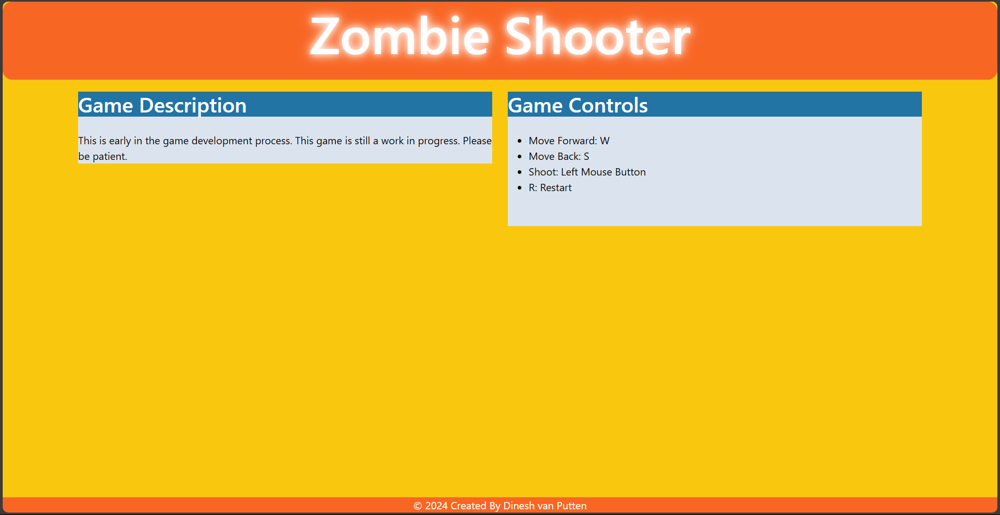
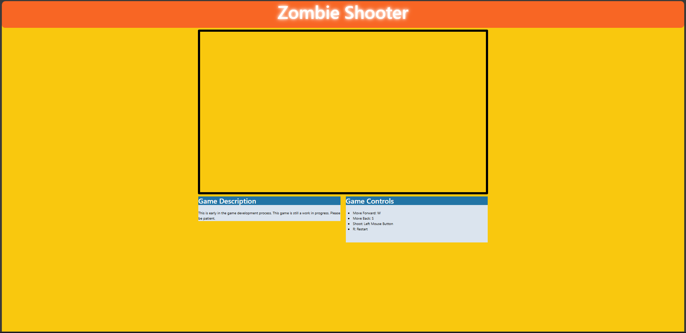
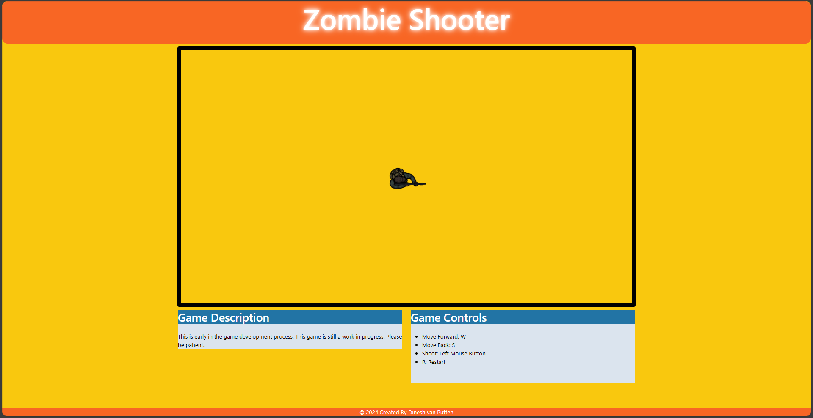
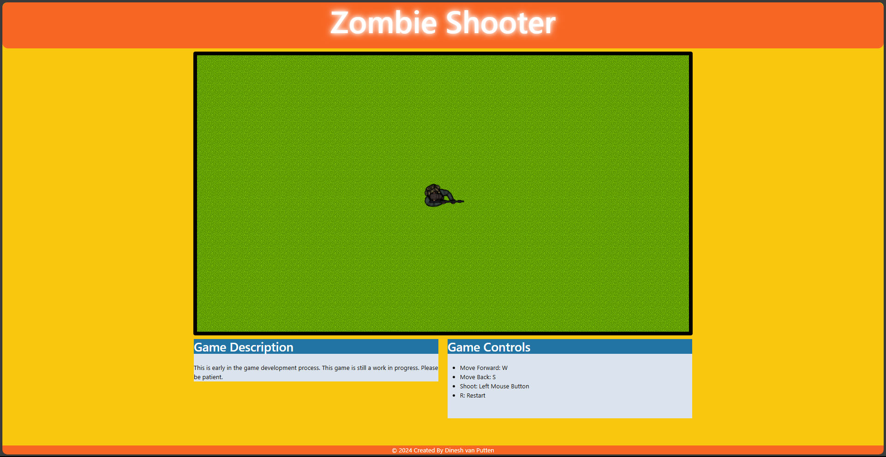
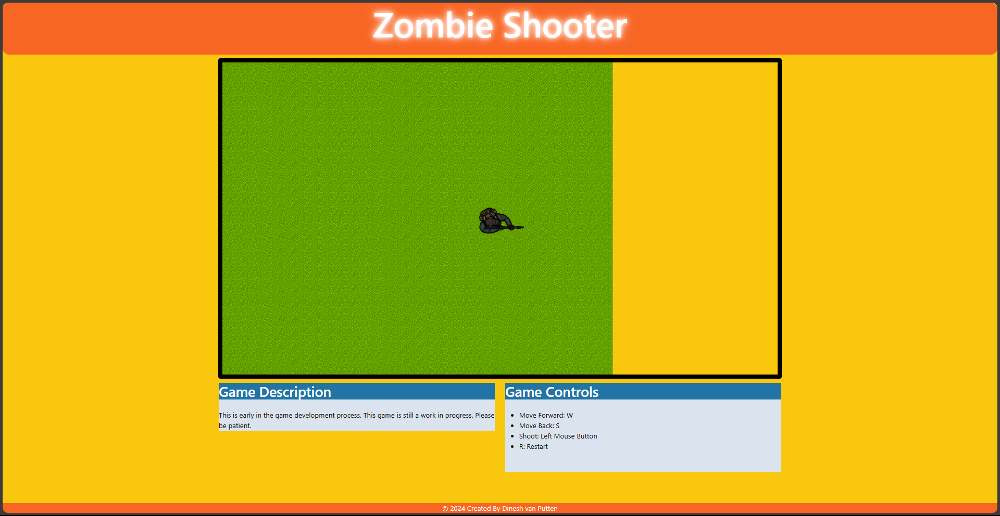
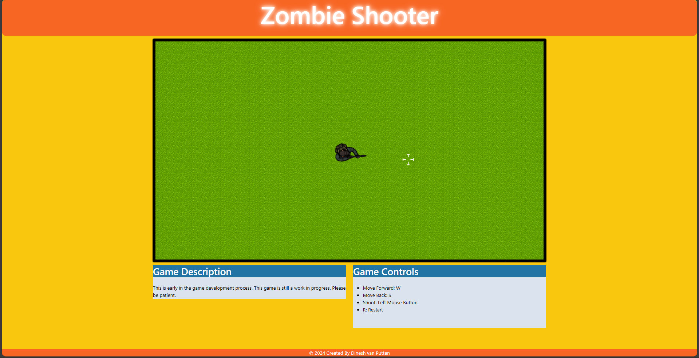
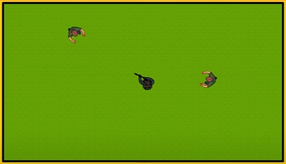
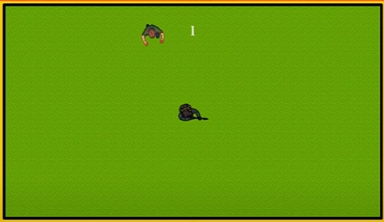
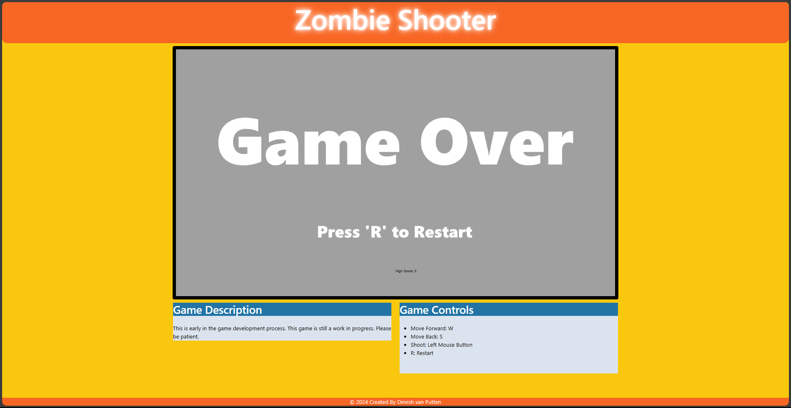

<!--badges-->
<div align="center">
  


</div>

# Game Documentation: Top-Down Zombie Shooter

## Overview
This JavaScript-based game is a top-down zombie shooter. The player controls a survivor armed with a shotgun, fending off waves of zombies while aiming for the highest score. The game features movement, shooting mechanics, animated sprites, and infinite scrolling terrain.

## Features
- **Player Movement:** Controlled via keyboard input.
- **Shooting Mechanic:** The player can fire bullets in bursts.
- **Zombie Behavior:** Zombies spawn at intervals, move toward the player, and attack upon collision.
- **Infinite Terrain:** Grass tiles shift seamlessly to simulate an infinite scrolling background.
- **Score System:** Tracks and displays the current and high scores.
- **Game Over Screen:** Displays when the player is overrun.
- **Animated Sprites:** For both player and zombies.

## Files Used
- Player and zombie sprites: Located in `images/Top_Down_Survivor` and `images/tds_zombie`.
- Background: `images/grass.png`
- Other assets: `images/bullet.png`, `images/crosshair097.png`, `images/Game Over.png`

## Variables
### Game Objects
- **Player, bullets, crosshair:** Main interactive elements.
- **Grass tiles:** Background tiles for infinite scrolling.
- **Zombies:** Hostile entities that spawn and chase the player.

### Game State
- **`gameOver`**: Boolean indicating whether the game is over.
- **`score`**: Current score.
- **`highscore`**: The highest score achieved.

### Movement
- **`moveForward`, `moveBackwards`:** Booleans for movement direction.
- **`angle`:** Determines player rotation.
- **`movementSpeed`:** Speed of player and zombies.

### Shooting
- **`canShoot`, `bulletActive`:** Control shooting state.
- **`bulletAngle`:** Direction of fired bullets.
- **`bulletSpeed`:** Speed of bullets.

### Animation
- **`playerMovementAnimation`, `zombieMovementAnimation`:** Arrays storing animation frames.
- **`imagesScale`:** Scale factor for sprite images.

### Background
- **Grass variables:** Manage the infinite scrolling terrain's position and dimensions.

## Code Structure
### 1. Initialization
The game begins with `startGame`, which initializes all game objects, resets variables, and sets up event listeners for input.

### 2. Canvas Setup
The `GameArea` object handles the creation, rendering, and clearing of the game canvas.

### 3. Components
The `Component` constructor is used for all visual elements (e.g., player, zombies, grass tiles). It supports updating position, rotation, and rendering animations.

### 4. Animation
Animated sprites are updated using frame arrays (e.g., `playerShootAnimation`, `zombieAttackAnimation`).

### 5. Input Handling
Keyboard and mouse inputs control:
- Movement (`W` for forward, `S` for backward).
- Shooting (via mouse click).
- Restarting the game (`R` key).

### 6. Game Loop
The `updateGameArea` function runs every 20ms to:
- Update all game components.
- Detect collisions.
- Animate sprites.
- Manage shooting mechanics and zombie movement.
- Render the current game state.

### 7. Collision and Scoring
Bullets can eliminate zombies, increasing the score. If zombies collide with the player, the game ends.

### 8. Infinite Terrain
Grass tiles are repositioned when the player moves beyond predefined bounds, creating the illusion of infinite scrolling.

### 9. Game Over
When the player is overrun, the game displays the high score and a restart prompt.

## How to Play
1. **Movement:** Use the `W` key to move forward and `S` to move backward.
2. **Aim:** Move the mouse to aim the shotgun.
3. **Shoot:** Click the left mouse button to fire.
4. **Restart:** Press the `R` key when the game is over.

## Future Enhancements
- Add power-ups and new weapons.
- Introduce multiple enemy types.
- Implement difficulty scaling.
- Add sound effects and background music.
- Improve zombie AI for varied behavior.

## Known Issues
- Bullet collision detection may fail if zombies overlap excessively.
- Restart logic could be optimized to reset game objects more efficiently.
- Performance may degrade as the number of zombies increases.

## Credits
This game utilizes assets from:
- [Top-Down Survivor Sprite Pack]
- [Zombie Sprite Pack]

---


<a name="readme-top"></a>

<!--Title-->
<div align="center">

## Zombie Shooter

</div>


<!--Sub-title-->
<div align="left">

## Overview

Zombie Shooter HTML Canvas created by Dinesh van Putten.
This is early in the game development process. This game is still a work in progress. Please be patient. 

Zombie Shooter is an HTML5-based game currently under development. This project uses HTML, CSS, and JavaScript to create an interactive browser-based game where players shoot zombies and navigate a simple interface.

This project demonstrates early-stage game development and is built with responsive design principles using Bootstrap. While functional, the game is still a work in progress, with room for further development and refinement.


</div>


<p align="right">(<a href="#readme-top">back to top</a>)</p>

<!--Description-->

<div align="left">

## Files Needed
1. Look for player design. [top-down-survivor-player](https://opengameart.org/content/animated-top-down-survivor-player)
2. Look for crosshair design. [crosshairs-pack-split](https://opengameart.org/content/64-crosshairs-pack-split)
3. Look for background design. [grass-for-scratch-background ](https://opengameart.org/content/grass-for-scratch-background)
4. Look for zombie design.[ animated-top-down-zombie](https://opengameart.org/content/animated-top-down-zombie)

</div>

<p align="right">(<a href="#readme-top">back to top</a>)</p>

<!--Description-->

<div align="left">

## Zip Files Version
1.  [Top_Down_Survivor.zip](https://opengameart.org/sites/default/files/Top_Down_Survivor_2.zip)
2. [Survivor Spine.zip](https://opengameart.org/sites/default/files/Survivor%20Spine.zip)
3. [Crosshairs 64.zip](https://opengameart.org/sites/default/files/Crosshairs%2064.zip)
4. [tds_zombie.zip](https://opengameart.org/sites/default/files/tds_zombie.zip)

</div>

<p align="right">(<a href="#readme-top">back to top</a>)</p>

<!--Description-->

<div align="left">

## Features
- 
- 
- 

## Gameplay
- Navigate using keyboard controls (`W`, `S`) and interact with the game using the mouse (left-click to shoot).
- A restart functionality is provided for seamless gameplay.
- Placeholders for advanced game mechanics, animations, and scoring.

## Design
- Stylish and responsive UI with a focus on readability and usability.
- Custom CSS and Bootstrap integration for consistent styling and layout.
- Glow effects and vibrant colors make the interface visually appealing.

</div>

<p align="right">(<a href="#readme-top">back to top</a>)</p>

<!--Description-->

<div align="left">

## Project Structure
- 
- 

</div>

<p align="right">(<a href="#readme-top">back to top</a>)</p>

<!--Description-->

<div align="left">

## Controls

| Action     | Key/Control      |
| ------------- | ------------- |
| Move Forward | `W` |
| Move Backward | `S` |
| Shoot | Left Mouse Button |
| Restart Game | `R |

</div>


<p align="right">(<a href="#readme-top">back to top</a>)</p>

<div align="left">

## Code Structure and TODOs
<p>This game is being developed incrementally, with placeholders for additional features and mechanics. Below is an outline of the key areas under development:</p>

<div align="left">

## References
- Game Objects:
  - Player
  - Bullets (e.g., `bullet1`, `bullet2`, `bullet3`)
  - Crosshair
  - Grass elements (`grass1` to `grass9`)
- Game Object Arrays:
  - Bullets array
  - Zombies array 
  - Grass elements array
- Score Variables:
  - `highscore`
  - `score`
- Gameplay Variables:
  - `gameOver`
  - `restartScreen`
  -  Shooting Variables:
-  Game Mechanics
   -  Player Movement Variables:
   -  `moveForward`
   -  `moveBackwards`
   -  `angle`
   -  `movementSpeed`
-  Zombie Variables:
   -  `zombiesWaitTime`
   -  `zombiesAnimationPosition`
   -  `zombiesPlayerCollision`
   -  `spawnZombiesInterval`
-  Shooting Variables:
   -  `bulletAngle`
   -  `bulletSpeed`
   -  `canShoot`
   -  `shootAnimationOver`
   -  `bulletActive`
-  Grass Variables:
   -  `currentMaxX`
   -  `currentMinX`
   -  `currentMaxY`
   -  `currentMinY`
-  Animations
   -  `playerSprite`
   -  `zombieSprite`
   -  `imagesScale`
-  Player animations: Movement, shooting, idle
-  Zombie animations: Movement, attacking


</div>

</div>


<p align="right">(<a href="#readme-top">back to top</a>)</p>
<div align="left">

## Planned Features
- Game Object Initialization:
  - Initialization routines for game entities like the player, zombies, bullets, and terrain.
- Advanced Animations:
  - Smooth and dynamic animations for players and zombies.
- Scoring and Game States:
  - Implement a scoring system and game-over/restart functionality.
- Interactive Environment:
  - Introduce randomized terrains, zombie spawns, and obstacles.

</div>


<p align="right">(<a href="#readme-top">back to top</a>)</p>
<div align="left">

## Development Notes
- The project is a work in progress, with frequent updates to functionality and visuals.
- The code uses strict mode (`"use strict"`) to enforce cleaner JavaScript coding practices.


</div>

<p align="right">(<a href="#readme-top">back to top</a>)</p>

<!--Description-->

<div align="left">

## Technology Stack
- 
- 

</div>

<p align="right">(<a href="#readme-top">back to top</a>)</p>

<!--Description-->

<div align="left">

## Development Status
This project is under development. Future updates will include:
- Improved gameplay mechanics.
- Enhanced graphics and animations.
- Additional levels and challenges.

</div>

<p align="right">(<a href="#readme-top">back to top</a>)</p>

<!--Description-->

<div align="left">

## Technologies Used
- 
- 

</div>

<p align="right">(<a href="#readme-top">back to top</a>)</p>

<!--Table of Contents-->
## Table of Contents
- [Game Documentation: Top-Down Zombie Shooter](#game-documentation-top-down-zombie-shooter)
  - [Overview](#overview)
  - [Features](#features)
  - [Files Used](#files-used)
  - [Variables](#variables)
    - [Game Objects](#game-objects)
    - [Game State](#game-state)
    - [Movement](#movement)
    - [Shooting](#shooting)
    - [Animation](#animation)
    - [Background](#background)
  - [Code Structure](#code-structure)
    - [1. Initialization](#1-initialization)
    - [2. Canvas Setup](#2-canvas-setup)
    - [3. Components](#3-components)
    - [4. Animation](#4-animation)
    - [5. Input Handling](#5-input-handling)
    - [6. Game Loop](#6-game-loop)
    - [7. Collision and Scoring](#7-collision-and-scoring)
    - [8. Infinite Terrain](#8-infinite-terrain)
    - [9. Game Over](#9-game-over)
  - [How to Play](#how-to-play)
  - [Future Enhancements](#future-enhancements)
  - [Known Issues](#known-issues)
  - [Credits](#credits)
  - [Zombie Shooter](#zombie-shooter)
  - [Overview](#overview-1)
  - [Files Needed](#files-needed)
  - [Zip Files Version](#zip-files-version)
  - [Features](#features-1)
  - [Gameplay](#gameplay)
  - [Design](#design)
  - [Project Structure](#project-structure)
  - [Controls](#controls)
  - [Code Structure and TODOs](#code-structure-and-todos)
  - [References](#references)
  - [Planned Features](#planned-features)
  - [Development Notes](#development-notes)
  - [Technology Stack](#technology-stack)
  - [Development Status](#development-status)
  - [Technologies Used](#technologies-used)
  - [Table of Contents](#table-of-contents)
  - [Installation](#installation)
  - [Walkthrough](#walkthrough)
          - [`"use strict"`](#use-strict)
          - [function `startGame()`](#function-startgame)
          - [Create Canvas](#create-canvas)
          - [`GameArea.start()`](#gameareastart)
          - [`this.context`](#thiscontext)
          - [`clearInterval();`](#clearinterval)
          - [`this.interval = setInterval()`](#thisinterval--setinterval)
          - [`updateGameArea`](#updategamearea)
          - [`GameArea.clear();`](#gameareaclear)
          - [`Game Context`](#game-context)
          - [`this.canvas.id`](#thiscanvasid)
          - [position of canvas using `document.body.insertBefore()`](#position-of-canvas-using-documentbodyinsertbefore)
          - [`h1Element`](#h1element)
          - [`h1Element.insertAdjacentElement`](#h1elementinsertadjacentelement)
          - [`clear: function()`](#clear-function)
          - [`this.context.clearRect()`](#thiscontextclearrect)
          - [`Game Objects`](#game-objects-1)
          - [Create `function Component()`](#create-function-component)
          - [`this.type`](#thistype)
          - [`Animation Variables`](#animation-variables)
          - [Add more to the`function Component`](#add-more-to-thefunction-component)
          - [`this.update = function()`](#thisupdate--function)
          - [`new Component`](#new-component)
          - [Add `Grass background`](#add-grass-background)
          - [update the `grass background`](#update-the-grass-background)
          - [Add `Player Movement Variables`](#add-player-movement-variables)
          - [Add `addEventListener`](#add-addeventlistener)
          - [`Enable Movement Input`](#enable-movement-input)
          - [`moveForward`](#moveforward)
          - [Add `onmousemove` function](#add-onmousemove-function)
          - [Add `grassArray`](#add-grassarray)
          - [Assign `grassArray`](#assign-grassarray)
          - [Move `grassArray`](#move-grassarray)
          - [Add `Grass variables`](#add-grass-variables)
          - [Add `Infinite grass`](#add-infinite-grass)
          - [Move `InfiniteGrass`](#move-infinitegrass)
          - [Call `InfiniteGrass()`](#call-infinitegrass)
          - [Add `Game Object` for `bullet`](#add-game-object-for-bullet)
          - [Add `Bullet variables`](#add-bullet-variables)
          - [Add `bullet` components](#add-bullet-components)
          - [Add `chrosshair` component](#add-chrosshair-component)
          - [Use `Arrays` for `bullets`](#use-arrays-for-bullets)
          - [Move other `game objects` when moving `player`](#move-other-game-objects-when-moving-player)
          - [Set `crosshair's` position](#set-crosshairs-position)
          - [Move `bullets`](#move-bullets)
          - [`Reload`](#reload)
          - [Add `bullet.update()`](#add-bulletupdate)
          - [`Shoot(event)` function](#shootevent-function)
          - [Declare `gameOver`](#declare-gameover)
          - [`crosshair.update()`](#crosshairupdate)
          - [`let zombies = []`](#let-zombies--)
          - [`let zombieSprite`](#let-zombiesprite)
          - [`Zombie Variables`](#zombie-variables)
          - [`spawnZombiesInterval`](#spawnzombiesinterval)
          - [`for loop` to loop through every single `zombies`](#for-loop-to-loop-through-every-single-zombies)
          - [Move `Zombies`](#move-zombies)
          - [update `zombies` in the `array`](#update-zombies-in-the-array)
          - [function `spawnZombie()`](#function-spawnzombie)
          - [`Zombie` spawn settings](#zombie-spawn-settings)
          - [function `getRandomInterval()`](#function-getrandominterval)
          - [`score` variables](#score-variables)
          - [`restartScreen`](#restartscreen)
          - [`reset game`](#reset-game)
          - [`Kill Zombies`](#kill-zombies)
          - [`Collision detection`](#collision-detection)
          - [`restartScreen.update()`](#restartscreenupdate)
          - [`function endGame()`](#function-endgame)
          - [`Score text` and `High score text`](#score-text-and-high-score-text)
          - [`Animation Arrays`](#animation-arrays)
          - [`Animation variables`](#animation-variables-1)
          - [` playerMovementAnimationFunction()`](#-playermovementanimationfunction)
          - [`playerShootAnimationFunction()`](#playershootanimationfunction)
          - [`playerIdleAnimationFunction()`](#playeridleanimationfunction)
          - [`zombieMovementAnimationFunction(zombieNum)`](#zombiemovementanimationfunctionzombienum)
          - [`zombieAttackAnimationFunction(zombieNum)`](#zombieattackanimationfunctionzombienum)
          - [`Movement` \& `Idle animation`](#movement--idle-animation)
          - [](#)
          - [](#-1)
          - [](#-2)
          - [](#-3)
          - [](#-4)
          - [](#-5)
          - [](#-6)
  - [License](#license)
  - [Contact](#contact)
  - [Acknowledgments](#acknowledgments)

<p align="right">(<a href="#readme-top">back to top</a>)</p>


<!--Installation-->
## Installation
Currently using [(version 1.84)](https://code.visualstudio.com/updates/v1_84) of [Visual Studio Code](https://code.visualstudio.com/)

* Install
```
  Visual Studio Code
```

- [x] Download `Visual Studio Code`
- [x] Make `New Folder`
- [x] Name `ZombieShooter`
- [x] Make `New Files`
- [x] Called `index.html`
- [x] Called `style.css`
- [x] Called `script.js`
- [x] Make `New Folder inside ZombieShooter`
- [x] Called `images`
- [ ] Multi-language Support
    - [ ] English

* Downloads
```
  opengameart.org
```

- [x] Download `Top Down Character`
- [x] Download `Crosshairs`
- [x] Download `Grass Background`
- [x] Download `Top Down Zombie`


<p align="right">(<a href="#readme-top">back to top</a>)</p>


## Walkthrough

<!--Walkthrough-->
This walkthrough shows no HTML and CSS but this is what you'll already would have.



<p align="right">(<a href="#readme-top">back to top</a>)</p>


<!--Step 1-->
> Step 1 
###### `"use strict"`
Add `use strict` to ensure that all our code is initalized when declaring variables using `let` keyword.
<p></p>

```
"use strict";
```

<p align="right">(<a href="#readme-top">back to top</a>)</p>

<!--Step 2-->
> Step 2
###### function `startGame()`


```
function startGame()
{

}
```

<p align="right">(<a href="#readme-top">back to top</a>)</p>

<!--Step 3-->
> Step 3
###### Create Canvas
Here we create our `GameArea`.
Also setting the width and height of the canvas with the `start: function()`.

```
// Create Canvas
let GameArea = {
  canvas: document.createElement("canvas"),
  start: function(){
    this.canvas.width = 1280;
    this.canvas.height = 720;
  }
}
```

<p align="right">(<a href="#readme-top">back to top</a>)</p>

<!--Step 4-->
> Step 4
###### `GameArea.start()`

So with our function once you click `GameArea.start()` we call the function and create a canvas with width of 1280 and height of 720.
```
function startGame()
{
  GameArea.start();
}   
```


<p align="right">(<a href="#readme-top">back to top</a>)</p>

<!--Step 5-->
> Step 5
###### `this.context`

```
this.context = this.canvas.getContext("2d");`
```

```
// Create Canvas
let GameArea = {
  canvas: document.createElement("canvas"),
  start: function(){
    this.canvas.width = 1280;
    this.canvas.height = 720;
    this.context = this.canvas.getContext("2d");`
  }
}
```

<p align="right">(<a href="#readme-top">back to top</a>)</p>


<!--Step 6-->
> Step 6
###### `clearInterval();`
We need to clear the interval.
<p></p>

```
clearInterval(GameArea.interval);
```

```
// Create Canvas
let GameArea = {
  canvas: document.createElement("canvas"),
  start: function(){
    this.canvas.width = 1280;
    this.canvas.height = 720;
    this.context = this.canvas.getContext("2d");
    clearInterval(GameArea.interval);
  }
}
```


<p align="right">(<a href="#readme-top">back to top</a>)</p>

<!--Step 7-->
> Step 7
###### `this.interval = setInterval()`
We're going to be running this every amount of seconds but we need to clear the interval and then we're going to create a branding interval.

```
this.interval = setInterval(updateGameArea, 20)
```

```
// Create Canvas
let GameArea = {
  canvas: document.createElement("canvas"),
  start: function(){
    this.canvas.width = 1280;
    this.canvas.height = 720;
    this.context = this.canvas.getContext("2d");
    clearInterval(GameArea.interval);
    this.interval = setInterval(updateGameArea, 20)
  }
}
```


<p align="right">(<a href="#readme-top">back to top</a>)</p>

<!--Step 8-->
> Step 8
###### `updateGameArea`
Create another function called `updateGameArea`

```
function updateGameArea(){

}    
```

<p align="right">(<a href="#readme-top">back to top</a>)</p>

<!--Step 9-->
> Step 9
###### `GameArea.clear();`
First clear everything thats in the `GameArea`

```
function updateGameArea(){
  GameArea.clear();
}        
```

<p align="right">(<a href="#readme-top">back to top</a>)</p>

<!--Step 10-->
> Step 10
###### `Game Context`
Then we're going to update them again once we have cleared everything because we don't want anything staying on the screen.

We have to first clear the screen and then update the screen.

```
// Game Context
let ctx = GameArea.context();
```

```
function updateGameArea(){
  GameArea.clear();

  // Game Context
  let ctx = GameArea.context();
} 
```

<p align="right">(<a href="#readme-top">back to top</a>)</p>


<!--Step 11-->
> Step 11
###### `this.canvas.id`
Now we can go back to the our canvas and create a `this.canvas.id` just in case you want to make any changes to the vis CSS.

```
this.canvas.id = "Game-Window";
```

```
// Create Canvas
let GameArea = {
  canvas: document.createElement("canvas"),
  start: function(){
    this.canvas.width = 1280;
    this.canvas.height = 720;
    this.context = this.canvas.getContext("2d");
    clearInterval(GameArea.interval);
    this.interval = setInterval(updateGameArea, 20)
    this.canvas.id = "Game-Window";
  }
}
```

<p align="right">(<a href="#readme-top">back to top</a>)</p>

<!--Step 12-->
> Step 12
###### position of canvas using `document.body.insertBefore()`
We need to put the position of the canvas underneath the Game Title.

```
// Put the canvas underneath the Game Title
document.body.insertBefore(this.canvas, document.body.childNodes[0]);

```

```
// Create Canvas
let GameArea = {
  canvas: document.createElement("canvas"),
  start: function(){
    this.canvas.width = 1280;
    this.canvas.height = 720;
    this.context = this.canvas.getContext("2d");
    clearInterval(GameArea.interval);
    this.interval = setInterval(updateGameArea, 20)
    this.canvas.id = "Game-Window";

    // Put the canvas underneath the Game Title
document.body.insertBefore(this.canvas, document.body.childNodes[0]);
  }
}
```

<p align="right">(<a href="#readme-top">back to top</a>)</p>

<!--Step 13-->
> Step 13
###### `h1Element`
We are not going in any `.childNodes[]` we just using the `h1Element`

```
let h1Element = document.querySelector("h1.Game-Title");
```

```
// Create Canvas
let GameArea = {
  canvas: document.createElement("canvas"),
  start: function(){
    this.canvas.width = 1280;
    this.canvas.height = 720;
    this.context = this.canvas.getContext("2d");
    clearInterval(GameArea.interval);
    this.interval = setInterval(updateGameArea, 20)
    this.canvas.id = "Game-Window";

    // Put the canvas underneath the Game Title
document.body.insertBefore(this.canvas, document.body.childNodes[0]);
let h1Element = document.querySelector("h1.Game-Title");
  }
}
```


<p align="right">(<a href="#readme-top">back to top</a>)</p>

<!--Step 14-->
> Step 14
###### `h1Element.insertAdjacentElement`


```
h1Element.insertAdjacentElement('afterend', this.canvas);
```

```
// Create Canvas
let GameArea = {
  canvas: document.createElement("canvas"),
  start: function(){
    this.canvas.width = 1280;
    this.canvas.height = 720;
    this.context = this.canvas.getContext("2d");
    clearInterval(GameArea.interval);
    this.interval = setInterval(updateGameArea, 20)
    this.canvas.id = "Game-Window";

    // Put the canvas underneath the Game Title
document.body.insertBefore(this.canvas, document.body.childNodes[0]);
let h1Element = document.querySelector("h1.Game-Title");
h1Element.insertAdjacentElement('afterend', this.canvas);
  }
}
```


<p align="right">(<a href="#readme-top">back to top</a>)</p>

<!--Step 15-->
> Step 15
###### `clear: function()`
Then all we need to do is is set a `clear: function()`

```
clear: function(){
  
}
```

```
// Create Canvas
let GameArea = {
  canvas: document.createElement("canvas"),
  start: function(){
    this.canvas.width = 1280;
    this.canvas.height = 720;
    this.context = this.canvas.getContext("2d");
    clearInterval(GameArea.interval);
    this.interval = setInterval(updateGameArea, 20)
    this.canvas.id = "Game-Window";

    // Put the canvas underneath the Game Title
document.body.insertBefore(this.canvas, document.body.childNodes[0]);
let h1Element = document.querySelector("h1.Game-Title");
h1Element.insertAdjacentElement('afterend', this.canvas);
  }, // remember to add a comma here

  clear: function(){
  
  }

}
```

<p align="right">(<a href="#readme-top">back to top</a>)</p>

<!--Step 16-->
> Step 16
###### `this.context.clearRect()`


```
clear: function(){
  this.context.clearRect(0,0,this.canvas.width,this.canvas.height);
  }
```

```
// Create Canvas
let GameArea = {
  canvas: document.createElement("canvas"),
  start: function(){
    this.canvas.width = 1280;
    this.canvas.height = 720;
    this.context = this.canvas.getContext("2d");
    clearInterval(GameArea.interval);
    this.interval = setInterval(updateGameArea, 20)
    this.canvas.id = "Game-Window";

    // Put the canvas underneath the Game Title
document.body.insertBefore(this.canvas, document.body.childNodes[0]);
let h1Element = document.querySelector("h1.Game-Title");
h1Element.insertAdjacentElement('afterend', this.canvas);
  }, // remember to add a comma here

  clear: function(){
  this.context.clearRect(0,0,this.canvas.width,this.canvas.height);
  }

}
```
Full code + Canvas.

```
"use strict";


function startGame()
{
    GameArea.start();
}


//Create Canvas
let GameArea = {
    canvas: document.createElement("canvas"),
    start: function() {
        this.canvas.width = 1280;
        this.canvas.height = 720;
        this.context = this.canvas.getContext("2d");
        clearInterval(GameArea.interval);
        this.interval = setInterval(updateGameArea, 20);
        this.canvas.id = "Game-Window";

        //Put the canvas underneath the Game Title
        document.body.insertBefore(this.canvas, document.body.childNodes[0]);
        let h1Element = document.querySelector("h1.Game-Title");
        h1Element.insertAdjacentElement("afterend", this.canvas);
    }, // remember to add a comma here

    clear: function() {
        this.context.clearRect(0,0,this.canvas.width, this.canvas.height);
    }
}

function updateGameArea(){
    GameArea.clear();

    //Game context
    let ctx = GameArea.context;
    
}
```



<p align="right">(<a href="#readme-top">back to top</a>)</p>

<!--Step 17-->
> Step 17
###### `Game Objects`
Now we can start adding components into the game so we're going to have a `player Sprite` and also some `grass background`

We are going to make some `variables`

```
"use strict";

// Variables


// Game Objects


```

We are gonna have 9 grasses around the screen because in our game we want to have `infinite` grass.

```
"use strict";

// Variables


// Game Objects
let player;
let grass1;
let grass2;
let grass3;
let grass4;
let grass5;
let grass6;
let grass7;
let grass8;
let grass9;
```

<p align="right">(<a href="#readme-top">back to top</a>)</p>

<!--Step 18-->
> Step 18
###### Create `function Component()`
We are gonna have some arguments that our component can take. 

```
function Component(width,height,source,x,y,type,angle=0){

  } 
```

Basically the `angle=0` is going to be used to rotate the player because we're going to have our player facing towards our cursor.

```
function Component(width,height,source,x,y,type,angle=0){

  } 


function updateGameArea(){
  let ctx = GameArea.context;
  } 
```

<p align="right">(<a href="#readme-top">back to top</a>)</p>

<!--Step 19-->
> Step 19
###### `this.type`
Then the `type` is just going to act differently if its a player or zombie or if its a grass object.

Each type is going to interact differently.

```
function Component(width,height,source,x,y,type,angle=0){
  this.type = type;
  this.angle = angle;
  } 
```


```
function Component(width,height,source,x,y,type,angle=0){
  this.type = type;
  this.angle = angle;
  } 


function updateGameArea(){
  let ctx = GameArea.context;
  } 
```

Now lets finish it up.

```
if(type === "image" || type === "grass")
{
  this.image = new Image();
  this.image.src = source;
}
else if(type === "player")
{
  this.image = new Image();
  this.image.src = playerSprite;
}
```
Finish look.

```
function Component(width,height,source,x,y,type,angle=0){
  this.type = type;
  this.angle = angle;

  if(type === "image" || type === "grass")
{
  this.image = new Image();
  this.image.src = source;
}
else if(type === "player")
{
  this.image = new Image();
  this.image.src = playerSprite;
}
  } 


function updateGameArea(){
  let ctx = GameArea.context;
  } 
```


<p align="right">(<a href="#readme-top">back to top</a>)</p>

<!--Step 20-->
> Step 20
###### `Animation Variables`
Now we go back to the top and comments to know where we are gonna animate our player.

```
// Animation Variables
let playerSprite = ""
```
Go to `Images` and enter `Top_Down_Survivor` to get `shotgun` and then we just want enter `idle` and get `survivor-idle_shotgun_0.png`.

```
// Animation Variables
let playerSprite = "images/Top_Down_Survivor/Top_Down_Survivor/shotgun/idle/survivor-idle_shotgun_0.png";
let imageScale = 0.5;
```

For context this is the location of the code.

```
// Game Objects
let player;
let grass1;
let grass2;
let grass3;
let grass4;
let grass5;
let grass6;
let grass7;
let grass8;
let grass9;

// Animation Variables
let playerSprite = "images/Top_Down_Survivor/Top_Down_Survivor/shotgun/idle/survivor-idle_shotgun_0.png";
let imagesScale = 0.5;
```


<p align="right">(<a href="#readme-top">back to top</a>)</p>

<!--Step 21-->
> Step 21
###### Add more to the`function Component`


```
this.width = width;
this.height = height;

this.x = x;
this.y = y;
```

```
function Component(width,height,source,x,y,type,angle=0){
  this.type = type;
  this.angle = angle;

  if(type === "image" || type === "grass")
{
  this.image = new Image();
  this.image.src = source;
}
else if(type === "player")
{
  this.image = new Image();
  this.image.src = playerSprite;
}
  }

this.width = width;
this.height = height;

this.x = x;
this.y = y; 


function updateGameArea(){
  let ctx = GameArea.context;
  } 
```


<p align="right">(<a href="#readme-top">back to top</a>)</p>

<!--Step 22-->
> Step 22
###### `this.update = function()`
Lets create a `this.update = function()` for our component.

```
this.update = function(){
  let ctx = GameArea.context;

  
  ctx.save();

  // Rotate the player image based on the angle
        ctx.translate(this.x + this.width/2, this.y + this.height/2);
        ctx.rotate(this.angle);

        //Images and Animated Images
        if(type === "image" || type === "grass")
        {
            ctx.drawImage(this.image, -this.width/2, -this.height/2, this.width, this.height);
        }
        else if(type === "player")
        {
            this.image.src = playerSprite;
            ctx.drawImage(this.image, -this.width/2, -this.height/2, this.width, this.height);

        }
            ctx.restore();
}
```

the code position

```
function Component(width,height,source,x,y,type,angle=0){

    this.type = type;
    this.angle = angle;

    if(type == "image" || type == "grass")
        {
          this.image = new Image();
          this.image.src = source;
        }
        else if(type == "player")
        {
          this.image = new Image();
          this.image.src = playerSprite;
        }

        this.width = width;
        this.height = height;

        this.x = x;
        this.y = y;

        this.update = function(){
            let ctx = GameArea.context;
          
            
            ctx.save();
          
            // Rotate the player image based on the angle
                  ctx.translate(this.x + this.width/2, this.y + this.height/2);
                  ctx.rotate(this.angle);
          
                  //Images and Animated Images
                  if(type === "image" || type === "grass")
                  {
                      ctx.drawImage(this.image, -this.width/2, -this.height/2, this.width, this.height);
                  }
                  else if(type === "player")
                  {
                      this.image.src = playerSprite;
                      ctx.drawImage(this.image, -this.width/2, -this.height/2, this.width, this.height);
          
                  }
                      ctx.restore();
          }
} 

function updateGameArea(){
    GameArea.clear();

    //Game context
    let ctx = GameArea.context;
    
}
```


<p align="right">(<a href="#readme-top">back to top</a>)</p>

<!--Step 23-->
> Step 23
###### `new Component`
Now we need to create a a component and see how it actually works.

```
//Initialize Game Objects
    player = new Component(313*imagesScale,207*imagesScale,playerSprite,640-(313*imagesScale)/2,360-(202*imagesScale)/2,"player",0);
```

```
// Animation Variables
let playerSprite = "images/Top_Down_Survivor/Top_Down_Survivor/shotgun/idle/survivor-idle_shotgun_0.png";
let imagesScale = 0.4;

function startGame()
{
    GameArea.start();
    player = new Component(313*imagesScale,207*imagesScale,playerSprite,640-(313*imagesScale)/2,360-(202*imagesScale)/2,"player",0);
}
```

Right under the `Game context` add ` player.update();`

```
function updateGameArea(){
    GameArea.clear();

  //Game context
  let ctx = GameArea.context;

  player.update();
}
```

This is how it would look like.



<p align="right">(<a href="#readme-top">back to top</a>)</p>

<!--Step 24-->
> Step 24
###### Add `Grass background`


```
grass1 = new Component(1280,720,"images/grass.png",-1280,720,"grass");
    grass2 = new Component(1280,720,"images/grass.png",0,720,"grass");
    grass3 = new Component(1280,720,"images/grass.png",1280,720,"grass");
    grass4 = new Component(1280,720,"images/grass.png",-1280,0,"grass");
    grass5 = new Component(1280,720,"images/grass.png",0,0,"grass");
    grass6 = new Component(1280,720,"images/grass.png",1280,0,"grass");
    grass7 = new Component(1280,720,"images/grass.png",-1280,-720,"grass");
    grass8 = new Component(1280,720,"images/grass.png",0,-720,"grass");
    grass9 = new Component(1280,720,"images/grass.png",1280,-720,"grass");
```

```
//Initialize Game Objects
    player = new Component(313*imagesScale,207*imagesScale,playerSprite,640-(313*imagesScale)/2,360-(202*imagesScale)/2,"player",0);
    grass1 = new Component(1280,720,"images/grass.png",-1280,720,"grass");
    grass2 = new Component(1280,720,"images/grass.png",0,720,"grass");
    grass3 = new Component(1280,720,"images/grass.png",1280,720,"grass");
    grass4 = new Component(1280,720,"images/grass.png",-1280,0,"grass");
    grass5 = new Component(1280,720,"images/grass.png",0,0,"grass");
    grass6 = new Component(1280,720,"images/grass.png",1280,0,"grass");
    grass7 = new Component(1280,720,"images/grass.png",-1280,720,"grass");
    grass8 = new Component(1280,720,"images/grass.png",0,-720,"grass");
    grass9 = new Component(1280,720,"images/grass.png",1280,-720,"grass");
```

Location of code.

```
function startGame()
{
    GameArea.start();
    player = new Component(313*imagesScale,207*imagesScale,playerSprite,640-(313*imagesScale)/2,360-(202*imagesScale)/2,"player",0);
    grass1 = new Component(1280,720,"images/grass.png",-1280,720,"grass");
    grass2 = new Component(1280,720,"images/grass.png",0,720,"grass");
    grass3 = new Component(1280,720,"images/grass.png",1280,720,"grass");
    grass4 = new Component(1280,720,"images/grass.png",-1280,0,"grass");
    grass5 = new Component(1280,720,"images/grass.png",0,0,"grass");
    grass6 = new Component(1280,720,"images/grass.png",1280,0,"grass");
    grass7 = new Component(1280,720,"images/grass.png",-1280,720,"grass");
    grass8 = new Component(1280,720,"images/grass.png",0,-720,"grass");
    grass9 = new Component(1280,720,"images/grass.png",1280,-720,"grass");
}
```

<p align="right">(<a href="#readme-top">back to top</a>)</p>

<!--Step 25-->
> Step 25
###### update the `grass background`

```
grass1.update();
grass2.update();
grass3.update();
grass4.update();
grass5.update();
grass6.update();
grass7.update();
grass8.update();
grass9.update();
```


```
function updateGameArea(){
    GameArea.clear();

  //Game context
  let ctx = GameArea.context;

  grass1.update();
  grass2.update();
  grass3.update();
  grass4.update();
  grass5.update();
  grass6.update();
  grass7.update();
  grass8.update();
  grass9.update();
  player.update(); // Make sure the player is at the bottom.
}
```



Full code + Component.

```
"use strict";

// Variables


// Game Objects
let player;
let grass1;
let grass2;
let grass3;
let grass4;
let grass5;
let grass6;
let grass7;
let grass8;
let grass9;

// Animation Variables
let playerSprite = "images/Top_Down_Survivor/Top_Down_Survivor/shotgun/idle/survivor-idle_shotgun_0.png";
let imagesScale = 0.4;

function startGame()
{
    GameArea.start();
    player = new Component(313*imagesScale,207*imagesScale,playerSprite,640-(313*imagesScale)/2,360-(202*imagesScale)/2,"player",0);
    grass1 = new Component(1280,720,"images/grass.png", -1280,720,"grass");
    grass2 = new Component(1280,720,"images/grass.png", 0,720,"grass");
    grass3 = new Component(1280,720,"images/grass.png", 1280,720,"grass");
    grass4 = new Component(1280,720,"images/grass.png", -1280,0,"grass");
    grass5 = new Component(1280,720,"images/grass.png", 0,0,"grass");
    grass6 = new Component(1280,720,"images/grass.png", 1280,0,"grass");
    grass7 = new Component(1280,720,"images/grass.png", -1280,720,"grass");
    grass8 = new Component(1280,720,"images/grass.png", 0,-720,"grass");
    grass9 = new Component(1280,720,"images/grass.png", 1280,-720,"grass");
}


//Create Canvas
let GameArea = {
    canvas: document.createElement("canvas"),
    start: function() {
        this.canvas.width = 1280;
        this.canvas.height = 720;
        this.context = this.canvas.getContext("2d");
        clearInterval(GameArea.interval);
        this.interval = setInterval(updateGameArea, 20);
        this.canvas.id = "Game-Window";

        //Put the canvas underneath the Game Title
        document.body.insertBefore(this.canvas, document.body.childNodes[0]);
        let h1Element = document.querySelector("h1.Game-Title");
        h1Element.insertAdjacentElement("afterend", this.canvas);
    }, // remember to add a comma here

    clear: function() {
        this.context.clearRect(0,0,this.canvas.width, this.canvas.height);
    }
}

function Component(width,height,source,x,y,type,angle=0){

    this.type = type;
    this.angle = angle;

    if(type === "image" || type === "grass")
        {
          this.image = new Image();
          this.image.src = source;
        }
        else if(type === "player")
        {
          this.image = new Image();
          this.image.src = playerSprite;
        }

        this.width = width;
        this.height = height;

        this.x = x;
        this.y = y;

        this.update = function(){
            let ctx = GameArea.context;
          
            
            ctx.save();
          
            // Rotate the player image based on the angle
                  ctx.translate(this.x + this.width/2, this.y + this.height/2);
                  ctx.rotate(this.angle);
          
                  //Images and Animated Images
                  if(type === "image" || type === "grass")
                  {
                      ctx.drawImage(this.image, -this.width/2, -this.height/2, this.width, this.height);
                  }
                  else if(type === "player")
                  {
                      this.image.src = playerSprite;
                      ctx.drawImage(this.image, -this.width/2, -this.height/2, this.width, this.height);
          
                    }
                    ctx.restore();
          }
} 

function updateGameArea(){
    GameArea.clear();

    //Game context
    let ctx = GameArea.context;


    grass1.update();
    grass2.update();
    grass3.update();
    grass4.update();
    grass5.update();
    grass6.update();
    grass7.update();
    grass8.update();
    grass9.update();
    player.update(); // Make sure the player is at the bottom.
}
```

<p align="right">(<a href="#readme-top">back to top</a>)</p>

<!--Step 26-->
> Step 26
###### Add `Player Movement Variables`
Here will start by adding movement to the player.


```
//Player Movement Variables
let moveForward;
let moveBackwards;
let angle;
let movementSpeed = 0.5;
```

Location of code

```
//Player Movement Variables
let moveForward;
let moveBackwards;
let angle;
let movementSpeed = 0.5;

// Animation Variables
let playerSprite = "images/Top_Down_Survivor/Top_Down_Survivor/shotgun/idle/survivor-idle_shotgun_0.png";
let imagesScale = 0.4;
```


<p align="right">(<a href="#readme-top">back to top</a>)</p>

<!--Step 27-->
> Step 27
###### Add `addEventListener`
To detect input. 

```
//Get Input
    window.addEventListener("keydown", handleMovementPress);
    window.addEventListener("keyup", handleMovementRelease);
    window.addEventListener("mousedown", Shoot);

```

Location of code.

```
function startGame()
{
    GameArea.start();
    player = new Component(313*imagesScale,207*imagesScale,playerSprite,640-(313*imagesScale)/2,360-(202*imagesScale)/2,"player",0);
    grass1 = new Component(1280,720,"images/grass.png", -1280,720,"grass");
    grass2 = new Component(1280,720,"images/grass.png", 0,720,"grass");
    grass3 = new Component(1280,720,"images/grass.png", 1280,720,"grass");
    grass4 = new Component(1280,720,"images/grass.png", -1280,0,"grass");
    grass5 = new Component(1280,720,"images/grass.png", 0,0,"grass");
    grass6 = new Component(1280,720,"images/grass.png", 1280,0,"grass");
    grass7 = new Component(1280,720,"images/grass.png", -1280,720,"grass");
    grass8 = new Component(1280,720,"images/grass.png", 0,-720,"grass");
    grass9 = new Component(1280,720,"images/grass.png", 1280,-720,"grass");

    //Get Input
    window.addEventListener("keydown", handleMovementPress);
    window.addEventListener("keyup", handleMovementRelease);
    window.addEventListener("mousedown", Shoot);
}
```

<p align="right">(<a href="#readme-top">back to top</a>)</p>


<!--Step 28-->
> Step 28
###### `Enable Movement Input`

```
//Enable Movement Input
function handleMovementPress(event) {
    let key = event.keyCode;
    if (key === 87) {
        moveForward = true;
    }
    else if (key === 83) {
        moveBackwards = true; 
    }
}

//Enable Movement Input
function handleMovementRelease(event) {
    let key = event.keyCode;
    if (key === 87) {
        moveForward = false;// Change to false for now.
    }
    else if (key === 83) {
        moveBackwards = false; // Change to false for now.
    }
}
```

Location of code.

```
function updateGameArea(){
    GameArea.clear();

    //Game context
    let ctx = GameArea.context;


    grass1.update();
    grass2.update();
    grass3.update();
    grass4.update();
    grass5.update();
    grass6.update();
    grass7.update();
    grass8.update();
    grass9.update();
    player.update(); // Make sure the player is at the bottom.
}

//Enable Movement Input
function handleMovementPress(event) {
    let key = event.keyCode;
    if (key === 87) {
        moveForward = true;
    }
    else if (key === 83) {
        moveBackwards = true; 
    }
}

//Enable Movement Input
function handleMovementRelease(event) {
    let key = event.keyCode;
    if (key === 87) {
        moveForward = false;// Change to false for now.
    }
    else if (key === 83) {
        moveBackwards = false; // Change to false for now.
    }
}
```

<p align="right">(<a href="#readme-top">back to top</a>)</p>


<!--Step 29-->
> Step 29
###### `moveForward`
We are going to be moving the grass not the player itself. So it looks like the player is moving. It's all just an illusion but the rest of the world is going to move with it as well.

```
if(type === "grass")
                    {
                        if(moveForward)
                        {
                            //move Player
                            this.x -= movementSpeed * 10 * Math.cos(player.angle);
                            this.y -= movementSpeed * 10 * Math.sin(player.angle);
                        }
                        else if(moveBackwards)
                        {
                          //move Player
                            this.x += movementSpeed * 10 * Math.cos(player.angle);
                            this.y += movementSpeed * 10 * Math.sin(player.angle);
                        }
                    }
```

Location of code.

```
function Component(width,height,source,x,y,type,angle=0){

    this.type = type;
    this.angle = angle;

    if(type === "image" || type === "grass")
        {
          this.image = new Image();
          this.image.src = source;
        }
        else if(type === "player")
        {
          this.image = new Image();
          this.image.src = playerSprite;
        }

        this.width = width;
        this.height = height;

        this.x = x;
        this.y = y;

        this.update = function(){
            let ctx = GameArea.context;
          
            
            ctx.save();
          
            // Rotate the player image based on the angle
                  ctx.translate(this.x + this.width/2, this.y + this.height/2);
                  ctx.rotate(this.angle);
          
                  //Images and Animated Images
                  if(type === "image" || type === "grass")
                  {
                      ctx.drawImage(this.image, -this.width/2, -this.height/2, this.width, this.height);
                  }
                  else if(type === "player")
                  {
                      this.image.src = playerSprite;
                      ctx.drawImage(this.image, -this.width/2, -this.height/2, this.width, this.height);
                    }

                    if(type === "grass")
                    {
                        if(moveForward)
                        {
                            //move Player
                            this.x -= movementSpeed * 10 * Math.cos(player.angle);
                            this.y -= movementSpeed * 10 * Math.sin(player.angle);
                        }
                        else if(moveBackwards)
                        {
                          //move Player
                            this.x += movementSpeed * 10 * Math.cos(player.angle);
                            this.y += movementSpeed * 10 * Math.sin(player.angle);
                        }
                    }

                    ctx.restore();
          }
} 
```

Going to test if the grass moves. If you go to the end you will notice the grass stopped. The grass isn't infinite we just have 9 grass blocks but it works and we tested.




<p align="right">(<a href="#readme-top">back to top</a>)</p>

<!--Step 30-->
> Step 30
###### Add `onmousemove` function
To move in any direction we want to.

```
//On mouse moved:
    onmousemove = function(e) {
        //Find players rotation
        let rect = GameArea.canvas.getBoundingClientRect();
        angle = Math.atan2(e.clientY-rect.top - player.y-150/2, e.clientX-rect.left - player.x-256/2);
        player.angle = angle;
    }
```

Location of code.

```
function updateGameArea(){
    GameArea.clear();

    //On mouse moved:
    onmousemove = function(e) {
        //Find players rotation
        let rect = GameArea.canvas.getBoundingClientRect();
        angle = Math.atan2(e.clientY-rect.top - player.y-150/2, e.clientX-rect.left - player.x-256/2);
        player.angle = angle;
    }

    //Game context
    let ctx = GameArea.context;


    grass1.update();
    grass2.update();
    grass3.update();
    grass4.update();
    grass5.update();
    grass6.update();
    grass7.update();
    grass8.update();
    grass9.update();
    player.update(); // Make sure the player is at the bottom.
}
```

Full code + Movement.

```
"use strict";

// Variables


// Game Objects
let player;
let grass1;
let grass2;
let grass3;
let grass4;
let grass5;
let grass6;
let grass7;
let grass8;
let grass9;

//Player Movement Variables
let moveForward;
let moveBackwards;
let angle;
let movementSpeed = 0.5;

// Animation Variables
let playerSprite = "images/Top_Down_Survivor/Top_Down_Survivor/shotgun/idle/survivor-idle_shotgun_0.png";
let imagesScale = 0.4;

function startGame()
{
    GameArea.start();
    player = new Component(313*imagesScale,207*imagesScale,playerSprite,640-(313*imagesScale)/2,360-(202*imagesScale)/2,"player",0);
    grass1 = new Component(1280,720,"images/grass.png", -1280,720,"grass");
    grass2 = new Component(1280,720,"images/grass.png", 0,720,"grass");
    grass3 = new Component(1280,720,"images/grass.png", 1280,720,"grass");
    grass4 = new Component(1280,720,"images/grass.png", -1280,0,"grass");
    grass5 = new Component(1280,720,"images/grass.png", 0,0,"grass");
    grass6 = new Component(1280,720,"images/grass.png", 1280,0,"grass");
    grass7 = new Component(1280,720,"images/grass.png", -1280,720,"grass");
    grass8 = new Component(1280,720,"images/grass.png", 0,-720,"grass");
    grass9 = new Component(1280,720,"images/grass.png", 1280,-720,"grass");

    //Get Input
    window.addEventListener("keydown", handleMovementPress);
    window.addEventListener("keyup", handleMovementRelease);
    window.addEventListener("mousedown", Shoot);
}


//Create Canvas
let GameArea = {
    canvas: document.createElement("canvas"),
    start: function() {
        this.canvas.width = 1280;
        this.canvas.height = 720;
        this.context = this.canvas.getContext("2d");
        clearInterval(GameArea.interval);
        this.interval = setInterval(updateGameArea, 20);
        this.canvas.id = "Game-Window";

        //Put the canvas underneath the Game Title
        document.body.insertBefore(this.canvas, document.body.childNodes[0]);
        let h1Element = document.querySelector("h1.Game-Title");
        h1Element.insertAdjacentElement("afterend", this.canvas);
    }, // remember to add a comma here

    clear: function() {
        this.context.clearRect(0,0,this.canvas.width, this.canvas.height);
    }
}

function Component(width,height,source,x,y,type,angle=0){

    this.type = type;
    this.angle = angle;

    if(type === "image" || type === "grass")
        {
          this.image = new Image();
          this.image.src = source;
        }
        else if(type === "player")
        {
          this.image = new Image();
          this.image.src = playerSprite;
        }

        this.width = width;
        this.height = height;

        this.x = x;
        this.y = y;

        this.update = function(){
            let ctx = GameArea.context;
          
            
            ctx.save();
          
            // Rotate the player image based on the angle
                  ctx.translate(this.x + this.width/2, this.y + this.height/2);
                  ctx.rotate(this.angle);
          
                  //Images and Animated Images
                  if(type === "image" || type === "grass")
                  {
                      ctx.drawImage(this.image, -this.width/2, -this.height/2, this.width, this.height);
                  }
                  else if(type === "player")
                  {
                      this.image.src = playerSprite;
                      ctx.drawImage(this.image, -this.width/2, -this.height/2, this.width, this.height);
                    }

                    if(type === "grass")
                    {
                        if(moveForward)
                        {
                            //move Player
                            this.x -= movementSpeed * 10 * Math.cos(player.angle);
                            this.y -= movementSpeed * 10 * Math.sin(player.angle);
                        }
                        else if(moveBackwards)
                        {
                            //move Player
                            this.x += movementSpeed * 10 * Math.cos(player.angle);
                            this.y += movementSpeed * 10 * Math.sin(player.angle);
                        }
                    }

                    ctx.restore();
          }
} 

function updateGameArea(){
    GameArea.clear();

    //On mouse moved:
    onmousemove = function(e) {
        //Find players rotation
        let rect = GameArea.canvas.getBoundingClientRect();
        angle = Math.atan2(e.clientY-rect.top - player.y-150/2, e.clientX-rect.left - player.x-256/2);
        player.angle = angle;
    }

    //Game context
    let ctx = GameArea.context;


    grass1.update();
    grass2.update();
    grass3.update();
    grass4.update();
    grass5.update();
    grass6.update();
    grass7.update();
    grass8.update();
    grass9.update();
    player.update(); // Make sure the player is at the bottom.
}

//Enable Movement Input
function handleMovementPress(event) {
    let key = event.keyCode;
    if (key === 87) {
        moveForward = true;
    }
    else if (key === 83) {
        moveBackwards = true; 
    }
}

//Disable Movement Input
function handleMovementRelease(event) {
    let key = event.keyCode;
    if (key === 87) {
        moveForward = false;// Change to false for now.
    }
    else if (key === 83) {
        moveBackwards = false; // Change to false for now.
    }
}
```

<p align="right">(<a href="#readme-top">back to top</a>)</p>

<!--Step 31-->
> Step 31
###### Add `grassArray`


```
//Game Objects Arrays
let grassArray = [];
```

Location of code.

```
// Game Objects
let player;
let grass1;
let grass2;
let grass3;
let grass4;
let grass5;
let grass6;
let grass7;
let grass8;
let grass9;

//Game Objects Arrays
let grassArray = [];
```

<p align="right">(<a href="#readme-top">back to top</a>)</p>

<!--Step 32-->
> Step 32
###### Assign `grassArray`
The grass is going to be set up in such a way that there are 9 grasses in the screen.
1. one in the top-left
2. one in the top-center
3. one in the top-right
4. one in the middle
5. one in the bottom

Basically if we like move to the top grass we want to replace it with the bottom grass and move that to the top and then do that for all the other different grasses. That is how we are going to move our grass.

```
grassArray = [grass1, grass2, grass3, grass4, grass5, grass6, grass7, grass8, grass9];
```

Location of code.

```
function startGame()
{
    GameArea.start();
    player = new Component(313*imagesScale,207*imagesScale,playerSprite,640-(313*imagesScale)/2,360-(202*imagesScale)/2,"player",0);
    grass1 = new Component(1280,720,"images/grass.png", -1280,720,"grass");
    grass2 = new Component(1280,720,"images/grass.png", 0,720,"grass");
    grass3 = new Component(1280,720,"images/grass.png", 1280,720,"grass");
    grass4 = new Component(1280,720,"images/grass.png", -1280,0,"grass");
    grass5 = new Component(1280,720,"images/grass.png", 0,0,"grass");
    grass6 = new Component(1280,720,"images/grass.png", 1280,0,"grass");
    grass7 = new Component(1280,720,"images/grass.png", -1280,720,"grass");
    grass8 = new Component(1280,720,"images/grass.png", 0,-720,"grass");
    grass9 = new Component(1280,720,"images/grass.png", 1280,-720,"grass");
    grassArray = [grass1, grass2, grass3, grass4, grass5, grass6, grass7, grass8, grass9];

    //Get Input
    window.addEventListener("keydown", handleMovementPress);
    window.addEventListener("keyup", handleMovementRelease);
    window.addEventListener("mousedown", Shoot);
}
```


<p align="right">(<a href="#readme-top">back to top</a>)</p>

<!--Step 33-->
> Step 33
###### Move `grassArray`


```
//Move Grass to the left
function moveGrassLeft()
{
    grassArray[2].x -= 1280*3;
    grassArray[5].x -= 1280*3;
    grassArray[8].x -= 1280*3;
    grassArray = [grassArray[2],grassArray[0],grassArray[1],grassArray[5],grassArray[3],grassArray[4],grassArray[8],grassArray[6],grassArray[7]];
}

//Move Grass to the right
function moveGrassRight()
{
    grassArray[0].x += 1280*3;
    grassArray[3].x += 1280*3;
    grassArray[6].x += 1280*3;
    grassArray = [grassArray[1],grassArray[2],grassArray[0],grassArray[4],grassArray[5],grassArray[3],grassArray[7],grassArray[8],grassArray[6]];
}

//Move Grass up
function moveGrassUp()
{
    grassArray[6].y += 720*3;
    grassArray[7].y += 720*3;
    grassArray[8].y += 720*3;
    grassArray = [grassArray[6],grassArray[7],grassArray[8],grassArray[0],grassArray[1],grassArray[2],grassArray[3],grassArray[4],grassArray[5]];
}

//Move Grass to the down
function moveGrassDown()
{
    grassArray[0].y -= 720*3;
    grassArray[1].y -= 720*3;
    grassArray[2].y -= 720*3;
    grassArray = [grassArray[3],grassArray[4],grassArray[5],grassArray[6],grassArray[7],grassArray[8],grassArray[0],grassArray[1],grassArray[2]];
}
```

Location of code.

```
//Move Grass to the left
function moveGrassLeft()
{
    grassArray[2].x -= 1280*3;
    grassArray[5].x -= 1280*3;
    grassArray[8].x -= 1280*3;
    grassArray = [grassArray[2],grassArray[0],grassArray[1],grassArray[5],grassArray[3],grassArray[4],grassArray[8],grassArray[6],grassArray[7]];
}

//Move Grass to the right
function moveGrassRight()
{
    grassArray[0].x += 1280*3;
    grassArray[3].x += 1280*3;
    grassArray[6].x += 1280*3;
    grassArray = [grassArray[1],grassArray[2],grassArray[0],grassArray[4],grassArray[5],grassArray[3],grassArray[7],grassArray[8],grassArray[6]];
}

//Move Grass up
function moveGrassUp()
{
    grassArray[6].y += 720*3;
    grassArray[7].y += 720*3;
    grassArray[8].y += 720*3;
    grassArray = [grassArray[6],grassArray[7],grassArray[8],grassArray[0],grassArray[1],grassArray[2],grassArray[3],grassArray[4],grassArray[5]];
}

//Move Grass to the down
function moveGrassDown()
{
    grassArray[0].y -= 720*3;
    grassArray[1].y -= 720*3;
    grassArray[2].y -= 720*3;
    grassArray = [grassArray[3],grassArray[4],grassArray[5],grassArray[6],grassArray[7],grassArray[8],grassArray[0],grassArray[1],grassArray[2]];
}

//Enable Movement Input
function handleMovementPress(event) {
    let key = event.keyCode;
    if (key === 87) {
        moveForward = true;
    }
    else if (key === 83) {
        moveBackwards = true; 
    }
}

//Disable Movement Input
function handleMovementRelease(event) {
    let key = event.keyCode;
    if (key === 87) {
        moveForward = false;// Change to false for now.
    }
    else if (key === 83) {
        moveBackwards = false; // Change to false for now.
    }
}
```

<p align="right">(<a href="#readme-top">back to top</a>)</p>

<!--Step 34-->
> Step 34 
###### Add `Grass variables`


```
//Grass variables
let currentMaxX = 1280;
let currentMinX = -1280;
let currentMaxY = 720;
let currentMinY = -720;
```

Location of code.

```
// Animation Variables
let playerSprite = "images/Top_Down_Survivor/Top_Down_Survivor/shotgun/idle/survivor-idle_shotgun_0.png";
let imagesScale = 0.4;

//Grass variables
let currentMaxX = 1280;
let currentMinX = -1280;
let currentMaxY = 720;
let currentMinY = -720;
```

<p align="right">(<a href="#readme-top">back to top</a>)</p>

<!--Step 35-->
> Step 35
###### Add `Infinite grass`


```
//Infinite grass
                if(grassArray[4].x+currentMaxX>currentMaxX)
                    {
                        moveGrassLeft();
                        currentMaxX+=1280;
                    }
                    else if(grassArray[4].x+currentMinX < currentMinX)
                    {
                        moveGrassRight();
                        currentMinX-=1280;
                    }
    
                    if(grassArray[4].y+currentMaxY > currentMaxY)
                    {
                        moveGrassDown();
                        currentMaxY+=720;
                    }
                    else if(grassArray[4].y+currentMinY < currentMinY)
                    {
                        moveGrassUp();
                        currentMinY-=720;
                    }
```

Location of code.

```
function Component(width,height,source,x,y,type,angle=0){

    this.type = type;
    this.angle = angle;

    if(type === "image" || type === "grass")
        {
          this.image = new Image();
          this.image.src = source;
        }
        else if(type === "player")
        {
          this.image = new Image();
          this.image.src = playerSprite;
        }

        this.width = width;
        this.height = height;

        this.x = x;
        this.y = y;

        this.update = function(){
            let ctx = GameArea.context;
          
            
            ctx.save();
          
            // Rotate the player image based on the angle
                  ctx.translate(this.x + this.width/2, this.y + this.height/2);
                  ctx.rotate(this.angle);
          
                  //Images and Animated Images
                  if(type === "image" || type === "grass")
                  {
                      ctx.drawImage(this.image, -this.width/2, -this.height/2, this.width, this.height);
                  }
                  else if(type === "player")
                  {
                      this.image.src = playerSprite;
                      ctx.drawImage(this.image, -this.width/2, -this.height/2, this.width, this.height);
                    }

                    if(type === "grass")
                    {
                        if(moveForward)
                        {
                            //move Player
                            this.x -= movementSpeed * 10 * Math.cos(player.angle);
                            this.y -= movementSpeed * 10 * Math.sin(player.angle);

                            //Infinite grass
                if(grassArray[4].x+currentMaxX>currentMaxX)
                    {
                        moveGrassLeft();
                        currentMaxX+=1280;
                    }
                    else if(grassArray[4].x+currentMinX < currentMinX)
                    {
                        moveGrassRight();
                        currentMinX-=1280;
                    }
    
                    if(grassArray[4].y+currentMaxY > currentMaxY)
                    {
                        moveGrassDown();
                        currentMaxY+=720;
                    }
                    else if(grassArray[4].y+currentMinY < currentMinY)
                    {
                        moveGrassUp();
                        currentMinY-=720;
                    }
                        }
                        else if(moveBackwards)
                        {
                            //move Player
                            this.x += movementSpeed * 10 * Math.cos(player.angle);
                            this.y += movementSpeed * 10 * Math.sin(player.angle);
                        }
                    }

                    ctx.restore();
          }
} 
```

<p align="right">(<a href="#readme-top">back to top</a>)</p>

<!--Step 36-->
> Step 36
###### Move `InfiniteGrass`
Move the previously created `InfiniteGrass` into another function.

```
function InfiniteGrass()
{

}
```

```
function InfiniteGrass()
{
    if(grassArray[4].x+currentMaxX>currentMaxX)
        {
            moveGrassLeft();
            currentMaxX+=1280;
        }
        else if(grassArray[4].x+currentMinX < currentMinX)
        {
            moveGrassRight();
            currentMinX-=1280;
        }

        if(grassArray[4].y+currentMaxY > currentMaxY)
        {
            moveGrassDown();
            currentMaxY+=720;
        }
        else if(grassArray[4].y+currentMinY < currentMinY)
        {
            moveGrassUp();
            currentMinY-=720;
        }
}
```

Location of code.

```
function InfiniteGrass()
{
    if(grassArray[4].x+currentMaxX>currentMaxX)
        {
            moveGrassLeft();
            currentMaxX+=1280;
        }
        else if(grassArray[4].x+currentMinX < currentMinX)
        {
            moveGrassRight();
            currentMinX-=1280;
        }

        if(grassArray[4].y+currentMaxY > currentMaxY)
        {
            moveGrassDown();
            currentMaxY+=720;
        }
        else if(grassArray[4].y+currentMinY < currentMinY)
        {
            moveGrassUp();
            currentMinY-=720;
        }
}

//Enable Movement Input
function handleMovementPress(event) {
    let key = event.keyCode;
    if (key === 87) {
        moveForward = true;
    }
    else if (key === 83) {
        moveBackwards = true; 
    }
}
```

<p align="right">(<a href="#readme-top">back to top</a>)</p>

<!--Step 37-->
> Step 37
###### Call `InfiniteGrass()`


```
//Infinite grass
InfiniteGrass();
```

Location of code.

```
if(type === "grass")
                    {
                        if(moveForward)
                        {
                            //move Player
                            this.x -= movementSpeed * 10 * Math.cos(player.angle);
                            this.y -= movementSpeed * 10 * Math.sin(player.angle);

                            //Infinite grass
                            InfiniteGrass();
                        }
                        else if(moveBackwards)
                        {
                            //move Player
                            this.x += movementSpeed * 10 * Math.cos(player.angle);
                            this.y += movementSpeed * 10 * Math.sin(player.angle);

                            //Infinite grass
                            InfiniteGrass();
                        }
                    }
```

Full code + Infinite Grass

```
"use strict";

// Variables


// Game Objects
let player;
let grass1;
let grass2;
let grass3;
let grass4;
let grass5;
let grass6;
let grass7;
let grass8;
let grass9;

//Game Objects Arrays
let grassArray = [];

//Player Movement Variables
let moveForward;
let moveBackwards;
let angle;
let movementSpeed = 0.5;

// Animation Variables
let playerSprite = "images/Top_Down_Survivor/Top_Down_Survivor/shotgun/idle/survivor-idle_shotgun_0.png";
let imagesScale = 0.4;

//Grass variables
let currentMaxX = 1280;
let currentMinX = -1280;
let currentMaxY = 720;
let currentMinY = -720;

function startGame()
{
    GameArea.start();
    player = new Component(313*imagesScale,207*imagesScale,playerSprite,640-(313*imagesScale)/2,360-(202*imagesScale)/2,"player",0);
    grass1 = new Component(1280,720,"images/grass.png", -1280,720,"grass");
    grass2 = new Component(1280,720,"images/grass.png", 0,720,"grass");
    grass3 = new Component(1280,720,"images/grass.png", 1280,720,"grass");
    grass4 = new Component(1280,720,"images/grass.png", -1280,0,"grass");
    grass5 = new Component(1280,720,"images/grass.png", 0,0,"grass");
    grass6 = new Component(1280,720,"images/grass.png", 1280,0,"grass");
    grass7 = new Component(1280,720,"images/grass.png", -1280,720,"grass");
    grass8 = new Component(1280,720,"images/grass.png", 0,-720,"grass");
    grass9 = new Component(1280,720,"images/grass.png", 1280,-720,"grass");
    grassArray = [grass1, grass2, grass3, grass4, grass5, grass6, grass7, grass8, grass9];

    //Get Input
    window.addEventListener("keydown", handleMovementPress);
    window.addEventListener("keyup", handleMovementRelease);
    window.addEventListener("mousedown", Shoot);
}


//Create Canvas
let GameArea = {
    canvas: document.createElement("canvas"),
    start: function() {
        this.canvas.width = 1280;
        this.canvas.height = 720;
        this.context = this.canvas.getContext("2d");
        clearInterval(GameArea.interval);
        this.interval = setInterval(updateGameArea, 20);
        this.canvas.id = "Game-Window";

        //Put the canvas underneath the Game Title
        document.body.insertBefore(this.canvas, document.body.childNodes[0]);
        let h1Element = document.querySelector("h1.Game-Title");
        h1Element.insertAdjacentElement("afterend", this.canvas);
    }, // remember to add a comma here

    clear: function() {
        this.context.clearRect(0,0,this.canvas.width, this.canvas.height);
    }
}

function Component(width,height,source,x,y,type,angle=0){

    this.type = type;
    this.angle = angle;

    if(type === "image" || type === "grass")
        {
          this.image = new Image();
          this.image.src = source;
        }
        else if(type === "player")
        {
          this.image = new Image();
          this.image.src = playerSprite;
        }

        this.width = width;
        this.height = height;

        this.x = x;
        this.y = y;

        this.update = function(){
            let ctx = GameArea.context;
          
            
            ctx.save();
          
            // Rotate the player image based on the angle
                  ctx.translate(this.x + this.width/2, this.y + this.height/2);
                  ctx.rotate(this.angle);
          
                  //Images and Animated Images
                  if(type === "image" || type === "grass")
                  {
                      ctx.drawImage(this.image, -this.width/2, -this.height/2, this.width, this.height);
                  }
                  else if(type === "player")
                  {
                      this.image.src = playerSprite;
                      ctx.drawImage(this.image, -this.width/2, -this.height/2, this.width, this.height);
                    }

                    if(type === "grass")
                    {
                        if(moveForward)
                        {
                            //move Player
                            this.x -= movementSpeed * 10 * Math.cos(player.angle);
                            this.y -= movementSpeed * 10 * Math.sin(player.angle);

                            //Infinite grass
                            InfiniteGrass();
                        }
                        else if(moveBackwards)
                        {
                            //move Player
                            this.x += movementSpeed * 10 * Math.cos(player.angle);
                            this.y += movementSpeed * 10 * Math.sin(player.angle);

                            //Infinite grass
                            InfiniteGrass();
                        }
                    }

                    ctx.restore();
          }
} 

function updateGameArea(){
    GameArea.clear();

    //On mouse moved:
    onmousemove = function(e) {
        //Find players rotation
        let rect = GameArea.canvas.getBoundingClientRect();
        angle = Math.atan2(e.clientY-rect.top - player.y-150/2, e.clientX-rect.left - player.x-256/2);
        player.angle = angle;
    }

    //Game context
    let ctx = GameArea.context;


    grass1.update();
    grass2.update();
    grass3.update();
    grass4.update();
    grass5.update();
    grass6.update();
    grass7.update();
    grass8.update();
    grass9.update();
    player.update(); // Make sure the player is at the bottom.
}

//Move Grass to the left
function moveGrassLeft()
{
    grassArray[2].x -= 1280*3;
    grassArray[5].x -= 1280*3;
    grassArray[8].x -= 1280*3;
    grassArray = [grassArray[2],grassArray[0],grassArray[1],grassArray[5],grassArray[3],grassArray[4],grassArray[8],grassArray[6],grassArray[7]];
}

//Move Grass to the right
function moveGrassRight()
{
    grassArray[0].x += 1280*3;
    grassArray[3].x += 1280*3;
    grassArray[6].x += 1280*3;
    grassArray = [grassArray[1],grassArray[2],grassArray[0],grassArray[4],grassArray[5],grassArray[3],grassArray[7],grassArray[8],grassArray[6]];
}

//Move Grass up
function moveGrassUp()
{
    grassArray[6].y += 720*3;
    grassArray[7].y += 720*3;
    grassArray[8].y += 720*3;
    grassArray = [grassArray[6],grassArray[7],grassArray[8],grassArray[0],grassArray[1],grassArray[2],grassArray[3],grassArray[4],grassArray[5]];
}

//Move Grass to the down
function moveGrassDown()
{
    grassArray[0].y -= 720*3;
    grassArray[1].y -= 720*3;
    grassArray[2].y -= 720*3;
    grassArray = [grassArray[3],grassArray[4],grassArray[5],grassArray[6],grassArray[7],grassArray[8],grassArray[0],grassArray[1],grassArray[2]];
}

function InfiniteGrass()
{
    if(grassArray[4].x+currentMaxX>currentMaxX)
        {
            moveGrassLeft();
            currentMaxX+=1280;
        }
        else if(grassArray[4].x+currentMinX < currentMinX)
        {
            moveGrassRight();
            currentMinX-=1280;
        }

        if(grassArray[4].y+currentMaxY > currentMaxY)
        {
            moveGrassDown();
            currentMaxY+=720;
        }
        else if(grassArray[4].y+currentMinY < currentMinY)
        {
            moveGrassUp();
            currentMinY-=720;
        }
}

//Enable Movement Input
function handleMovementPress(event) {
    let key = event.keyCode;
    if (key === 87) {
        moveForward = true;
    }
    else if (key === 83) {
        moveBackwards = true; 
    }
}

//Disable Movement Input
function handleMovementRelease(event) {
    let key = event.keyCode;
    if (key === 87) {
        moveForward = false;// Change to false for now.
    }
    else if (key === 83) {
        moveBackwards = false; // Change to false for now.
    }
}
```

<p align="right">(<a href="#readme-top">back to top</a>)</p>

<!--Step 38-->
> Step 38
###### Add `Game Object` for `bullet`


```
let bullet1;
let bullet2;
let bullet3;
let crosshair;
```

Location of code.

```
// Game Objects
let player;
let grass1;
let grass2;
let grass3;
let grass4;
let grass5;
let grass6;
let grass7;
let grass8;
let grass9;
let bullet1;
let bullet2;
let bullet3;
let crosshair;
```

<p align="right">(<a href="#readme-top">back to top</a>)</p>

<!--Step 39-->
> Step 39
###### Add `Bullet variables`


```
//Bullet variables
let bulletAngle;
let bulletSpeed = 20;
let canShoot = true;
let shootAnimationOver = true;
let bulletActive = false;
```

Location of code.

```
//Game Objects Arrays
let grassArray = [];

//Player Movement Variables
let moveForward;
let moveBackwards;
let angle;
let movementSpeed = 0.5;

//Bullet variables
let bulletAngle;
let bulletSpeed = 20;
let canShoot = true;
let shootAnimationOver = true;
let bulletActive = false;
```

<p align="right">(<a href="#readme-top">back to top</a>)</p>


<!--Step 40-->
> Step 40
###### Add `bullet` components


```
    bullet1 = new Component(10,2,"images/bullet.png",-10,-2,"image");
    bullet2 = new Component(10,2,"images/bullet.png",-10,-2,"image");
    bullet3 = new Component(10,2,"images/bullet.png",-10,-2,"image");
```

Location of code.

```
function startGame()
{
    GameArea.start();
    player = new Component(313*imagesScale,207*imagesScale,playerSprite,640-(313*imagesScale)/2,360-(202*imagesScale)/2,"player",0);
    grass1 = new Component(1280,720,"images/grass.png", -1280,720,"grass");
    grass2 = new Component(1280,720,"images/grass.png", 0,720,"grass");
    grass3 = new Component(1280,720,"images/grass.png", 1280,720,"grass");
    grass4 = new Component(1280,720,"images/grass.png", -1280,0,"grass");
    grass5 = new Component(1280,720,"images/grass.png", 0,0,"grass");
    grass6 = new Component(1280,720,"images/grass.png", 1280,0,"grass");
    grass7 = new Component(1280,720,"images/grass.png", -1280,720,"grass");
    grass8 = new Component(1280,720,"images/grass.png", 0,-720,"grass");
    grass9 = new Component(1280,720,"images/grass.png", 1280,-720,"grass");
    bullet1 = new Component(10,2,"images/bullet.png",-10,-2,"image");
    bullet2 = new Component(10,2,"images/bullet.png",-10,-2,"image");
    bullet3 = new Component(10,2,"images/bullet.png",-10,-2,"image");
    grassArray = [grass1, grass2, grass3, grass4, grass5, grass6, grass7, grass8, grass9];

    //Get Input
    window.addEventListener("keydown", handleMovementPress);
    window.addEventListener("keyup", handleMovementRelease);
    window.addEventListener("mousedown", Shoot);
}
```

<p align="right">(<a href="#readme-top">back to top</a>)</p>

<!--Step 41-->
> Step 41
###### Add `chrosshair` component


```
crosshair = new Component(40,40,"images/crosshair097.png",640,360,"image");
```

Location of code.

```
function startGame()
{
    GameArea.start();
    player = new Component(313*imagesScale,207*imagesScale,playerSprite,640-(313*imagesScale)/2,360-(202*imagesScale)/2,"player",0);
    grass1 = new Component(1280,720,"images/grass.png", -1280,720,"grass");
    grass2 = new Component(1280,720,"images/grass.png", 0,720,"grass");
    grass3 = new Component(1280,720,"images/grass.png", 1280,720,"grass");
    grass4 = new Component(1280,720,"images/grass.png", -1280,0,"grass");
    grass5 = new Component(1280,720,"images/grass.png", 0,0,"grass");
    grass6 = new Component(1280,720,"images/grass.png", 1280,0,"grass");
    grass7 = new Component(1280,720,"images/grass.png", -1280,720,"grass");
    grass8 = new Component(1280,720,"images/grass.png", 0,-720,"grass");
    grass9 = new Component(1280,720,"images/grass.png", 1280,-720,"grass");
    bullet1 = new Component(10,2,"images/bullet.png",-10,-2,"image");
    bullet2 = new Component(10,2,"images/bullet.png",-10,-2,"image");
    bullet3 = new Component(10,2,"images/bullet.png",-10,-2,"image");
    crosshair = new Component(40,40,"images/crosshair097.png",640,360,"image");
    grassArray = [grass1, grass2, grass3, grass4, grass5, grass6, grass7, grass8, grass9];

    //Get Input
    window.addEventListener("keydown", handleMovementPress);
    window.addEventListener("keyup", handleMovementRelease);
    window.addEventListener("mousedown", Shoot);
}
```

<p align="right">(<a href="#readme-top">back to top</a>)</p>

<!--Step 42-->
> Step 42
###### Use `Arrays` for `bullets`


```
bullets = [bullet1,bullet2,bullet3];
```

Location of code.

```
function startGame()
{
    GameArea.start();
    player = new Component(313*imagesScale,207*imagesScale,playerSprite,640-(313*imagesScale)/2,360-(202*imagesScale)/2,"player",0);
    grass1 = new Component(1280,720,"images/grass.png", -1280,720,"grass");
    grass2 = new Component(1280,720,"images/grass.png", 0,720,"grass");
    grass3 = new Component(1280,720,"images/grass.png", 1280,720,"grass");
    grass4 = new Component(1280,720,"images/grass.png", -1280,0,"grass");
    grass5 = new Component(1280,720,"images/grass.png", 0,0,"grass");
    grass6 = new Component(1280,720,"images/grass.png", 1280,0,"grass");
    grass7 = new Component(1280,720,"images/grass.png", -1280,720,"grass");
    grass8 = new Component(1280,720,"images/grass.png", 0,-720,"grass");
    grass9 = new Component(1280,720,"images/grass.png", 1280,-720,"grass");
    bullet1 = new Component(10,2,"images/bullet.png",-10,-2,"image");
    bullet2 = new Component(10,2,"images/bullet.png",-10,-2,"image");
    bullet3 = new Component(10,2,"images/bullet.png",-10,-2,"image");
    crosshair = new Component(40,40,"images/crosshair097.png",640,360,"image");
    grassArray = [grass1, grass2, grass3, grass4, grass5, grass6, grass7, grass8, grass9];
    bullets = [bullet1,bullet2,bullet3];

    //Get Input
    window.addEventListener("keydown", handleMovementPress);
    window.addEventListener("keyup", handleMovementRelease);
    window.addEventListener("mousedown", Shoot);
}
```

<p align="right">(<a href="#readme-top">back to top</a>)</p>

<!--Step 43-->
> Step 43
###### Move other `game objects` when moving `player`

When we're shooting the bullets, we want our bullets to move with the grass. If we shoot we want it to be relative to the ground as well. 

```
//Move other game objects when moving player
bullet1.x -= movementSpeed * Math.cos(bulletAngle);
bullet1.y -= movementSpeed * Math.sin(bulletAngle);

bullet2.x -= movementSpeed * Math.cos(bulletAngle);
bullet2.y -= movementSpeed * Math.sin(bulletAngle);

bullet3.x -= movementSpeed * Math.cos(bulletAngle);
bullet3.y -= movementSpeed * Math.sin(bulletAngle);
```

```
//Move other game objects when moving player
bullet1.x += movementSpeed * Math.cos(bulletAngle);
bullet1.y += movementSpeed * Math.sin(bulletAngle);

bullet2.x += movementSpeed * Math.cos(bulletAngle);
bullet2.y += movementSpeed * Math.sin(bulletAngle);

bullet3.x += movementSpeed * Math.cos(bulletAngle);
bullet3.y += movementSpeed * Math.sin(bulletAngle);
```

Location of code.

```
function Component(width,height,source,x,y,type,angle=0){

    this.type = type;
    this.angle = angle;

    if(type === "image" || type === "grass")
        {
          this.image = new Image();
          this.image.src = source;
        }
        else if(type === "player")
        {
          this.image = new Image();
          this.image.src = playerSprite;
        }

        this.width = width;
        this.height = height;

        this.x = x;
        this.y = y;

        this.update = function(){
            let ctx = GameArea.context;
          
            
            ctx.save();
          
            // Rotate the player image based on the angle
                  ctx.translate(this.x + this.width/2, this.y + this.height/2);
                  ctx.rotate(this.angle);
          
                  //Images and Animated Images
                  if(type === "image" || type === "grass")
                  {
                      ctx.drawImage(this.image, -this.width/2, -this.height/2, this.width, this.height);
                  }
                  else if(type === "player")
                  {
                      this.image.src = playerSprite;
                      ctx.drawImage(this.image, -this.width/2, -this.height/2, this.width, this.height);
                    }

                    if(type === "grass")
                    {
                        if(moveForward)
                        {
                            //move Player
                            this.x -= movementSpeed * 10 * Math.cos(player.angle);
                            this.y -= movementSpeed * 10 * Math.sin(player.angle);

                            //Move other game objects when moving player
                bullet1.x -= movementSpeed * Math.cos(bulletAngle);
                bullet1.y -= movementSpeed * Math.sin(bulletAngle);

                bullet2.x -= movementSpeed * Math.cos(bulletAngle);
                bullet2.y -= movementSpeed * Math.sin(bulletAngle);

                bullet3.x -= movementSpeed * Math.cos(bulletAngle);
                bullet3.y -= movementSpeed * Math.sin(bulletAngle);

                            //Infinite grass
                            InfiniteGrass();
                        }
                        else if(moveBackwards)
                        {
                            //move Player
                            this.x += movementSpeed * 10 * Math.cos(player.angle);
                            this.y += movementSpeed * 10 * Math.sin(player.angle);

                            //Move other game objects when moving player
                bullet1.x += movementSpeed * Math.cos(bulletAngle);
                bullet1.y += movementSpeed * Math.sin(bulletAngle);

                bullet2.x += movementSpeed * Math.cos(bulletAngle);
                bullet2.y += movementSpeed * Math.sin(bulletAngle);

                bullet3.x += movementSpeed * Math.cos(bulletAngle);
                bullet3.y += movementSpeed * Math.sin(bulletAngle);

                            //Infinite grass
                            InfiniteGrass();
                        }
                    }

                    ctx.restore();
          }
} 
```

<p align="right">(<a href="#readme-top">back to top</a>)</p>

<!--Step 44-->
> Step 44
###### Set `crosshair's` position

When we move the mouse we want to change where our crosshair is pointing.

```
//Set crosshair's position
crosshair.x = e.clientX-rect.left-20;
crosshair.y = e.clientY-rect.top-17;
```

Location of code.

```
//On mouse moved:
    onmousemove = function(e) {
        //Find players rotation
        let rect = GameArea.canvas.getBoundingClientRect();
        angle = Math.atan2(e.clientY-rect.top - player.y-150/2, e.clientX-rect.left - player.x-256/2);
        player.angle = angle;

        //Set crosshair's position
        crosshair.x = e.clientX-rect.left-20;
        crosshair.y = e.clientY-rect.top-17;
    }
```

<p align="right">(<a href="#readme-top">back to top</a>)</p>

<!--Step 45-->
> Step 45
###### Move `bullets`


```
// Move bullets
    if(bulletActive){
        let bullet1Turn = ((Math.random())*3) * Math.PI/180;
        let bullet2Turn = 0;
        let bullet3Turn = ((Math.random()-1)*3) * Math.PI/180;

        bullet1.x += bulletSpeed * Math.cos(bulletAngle+bullet1Turn);
        bullet1.y += bulletSpeed * Math.sin(bulletAngle+bullet1Turn);

        bullet2.x += bulletSpeed * Math.cos(bulletAngle+bullet2Turn);
        bullet2.y += bulletSpeed * Math.sin(bulletAngle+bullet2Turn);

        bullet3.x += bulletSpeed * Math.cos(bulletAngle+bullet3Turn);
        bullet3.y += bulletSpeed * Math.sin(bulletAngle+bullet3Turn);
    }
```

Location of code.

```
function updateGameArea(){
    GameArea.clear();

    //On mouse moved:
    onmousemove = function(e) {
        //Find players rotation
        let rect = GameArea.canvas.getBoundingClientRect();
        angle = Math.atan2(e.clientY-rect.top - player.y-150/2, e.clientX-rect.left - player.x-256/2);
        player.angle = angle;

        //Set crosshair's position
        crosshair.x = e.clientX-rect.left-20;
        crosshair.y = e.clientY-rect.top-17;
    }

    // Move bullets
    if(bulletActive){
        let bullet1Turn = ((Math.random())*3) * Math.PI/180;
        let bullet2Turn = 0;
        let bullet3Turn = ((Math.random()-1)*3) * Math.PI/180;

        bullet1.x += bulletSpeed * Math.cos(bulletAngle+bullet1Turn);
        bullet1.y += bulletSpeed * Math.sin(bulletAngle+bullet1Turn);

        bullet2.x += bulletSpeed * Math.cos(bulletAngle+bullet2Turn);
        bullet2.y += bulletSpeed * Math.sin(bulletAngle+bullet2Turn);

        bullet3.x += bulletSpeed * Math.cos(bulletAngle+bullet3Turn);
        bullet3.y += bulletSpeed * Math.sin(bulletAngle+bullet3Turn);
    }

    //Game context
    let ctx = GameArea.context;


    grass1.update();
    grass2.update();
    grass3.update();
    grass4.update();
    grass5.update();
    grass6.update();
    grass7.update();
    grass8.update();
    grass9.update();
    player.update(); // Make sure the player is at the bottom.
}
```

<p align="right">(<a href="#readme-top">back to top</a>)</p>

<!--Step 46-->
> Step 46
###### `Reload`


```
// Reload
        if(bullet1.x > 1280)
        {
            canShoot = true;
        }
        else if(bullet1.x < 0)
        {
            canShoot = true;
        }
        else if(bullet1.y < 0)
        {
            canShoot = true;
        }
        else if(bullet1.y > 720)
        {
            canShoot = true;
        }
```

Location of code.

```
function updateGameArea(){
    GameArea.clear();

    //On mouse moved:
    onmousemove = function(e) {
        //Find players rotation
        let rect = GameArea.canvas.getBoundingClientRect();
        angle = Math.atan2(e.clientY-rect.top - player.y-150/2, e.clientX-rect.left - player.x-256/2);
        player.angle = angle;

        //Set crosshair's position
        crosshair.x = e.clientX-rect.left-20;
        crosshair.y = e.clientY-rect.top-17;
    }

    // Move bullets
    if(bulletActive){
        let bullet1Turn = ((Math.random())*3) * Math.PI/180;
        let bullet2Turn = 0;
        let bullet3Turn = ((Math.random()-1)*3) * Math.PI/180;

        bullet1.x += bulletSpeed * Math.cos(bulletAngle+bullet1Turn);
        bullet1.y += bulletSpeed * Math.sin(bulletAngle+bullet1Turn);

        bullet2.x += bulletSpeed * Math.cos(bulletAngle+bullet2Turn);
        bullet2.y += bulletSpeed * Math.sin(bulletAngle+bullet2Turn);

        bullet3.x += bulletSpeed * Math.cos(bulletAngle+bullet3Turn);
        bullet3.y += bulletSpeed * Math.sin(bulletAngle+bullet3Turn);

        // Reload
        if(bullet1.x > 1280)
            {
                canShoot = true;
            }
            else if(bullet1.x < 0)
            {
                canShoot = true;
            }
            else if(bullet1.y < 0)
            {
                canShoot = true;
            }
            else if(bullet1.y > 720)
            {
                canShoot = true;
            }
    }

    //Game context
    let ctx = GameArea.context;


    grass1.update();
    grass2.update();
    grass3.update();
    grass4.update();
    grass5.update();
    grass6.update();
    grass7.update();
    grass8.update();
    grass9.update();
    player.update(); // Make sure the player is at the bottom.
}
```

<p align="right">(<a href="#readme-top">back to top</a>)</p>

<!--Step 47-->
> Step 47
###### Add `bullet.update()`


```
bullet1.update()
bullet2.update()
bullet3.update()
```

Location of code.

```
function updateGameArea(){
    GameArea.clear();

    //On mouse moved:
    onmousemove = function(e) {
        //Find players rotation
        let rect = GameArea.canvas.getBoundingClientRect();
        angle = Math.atan2(e.clientY-rect.top - player.y-150/2, e.clientX-rect.left - player.x-256/2);
        player.angle = angle;

        //Set crosshair's position
        crosshair.x = e.clientX-rect.left-20;
        crosshair.y = e.clientY-rect.top-17;
    }

    // Move bullets
    if(bulletActive){
        let bullet1Turn = ((Math.random())*3) * Math.PI/180;
        let bullet2Turn = 0;
        let bullet3Turn = ((Math.random()-1)*3) * Math.PI/180;

        bullet1.x += bulletSpeed * Math.cos(bulletAngle+bullet1Turn);
        bullet1.y += bulletSpeed * Math.sin(bulletAngle+bullet1Turn);

        bullet2.x += bulletSpeed * Math.cos(bulletAngle+bullet2Turn);
        bullet2.y += bulletSpeed * Math.sin(bulletAngle+bullet2Turn);

        bullet3.x += bulletSpeed * Math.cos(bulletAngle+bullet3Turn);
        bullet3.y += bulletSpeed * Math.sin(bulletAngle+bullet3Turn);

        // Reload
        if(bullet1.x > 1280)
            {
                canShoot = true;
            }
            else if(bullet1.x < 0)
            {
                canShoot = true;
            }
            else if(bullet1.y < 0)
            {
                canShoot = true;
            }
            else if(bullet1.y > 720)
            {
                canShoot = true;
            }
    }

    // Game context
    let ctx = GameArea.context;


    grass1.update();
    grass2.update();
    grass3.update();
    grass4.update();
    grass5.update();
    grass6.update();
    grass7.update();
    grass8.update();
    grass9.update();
    player.update();
    bullet1.update()
    bullet2.update()
    bullet3.update()
}
```

<p align="right">(<a href="#readme-top">back to top</a>)</p>


<!--Step 48-->
> Step 48
###### `Shoot(event)` function


```
function Shoot(event)
{
    if(event.button === 0)
    {
        if(canShoot && !gameOver)
        {
            shootAnimationOver = false;
            bulletActive = true;
            bullet1.x = 640;
            bullet1.y = 360;
            bullet1.angle = player.angle;

            bullet2.x = 640;
            bullet2.y = 360;
            bullet2.angle = player.angle;

            bullet3.x = 640;
            bullet3.y = 360;
            bullet3.angle = player.angle;

            bulletAngle = player.angle;
            canShoot = false;
        }
    }
}
```

Location of code.

```
//Disable Movement Input
function handleMovementRelease(event) {
    let key = event.keyCode;
    if (key === 87) {
        moveForward = false;// Change to false for now.
    }
    else if (key === 83) {
        moveBackwards = false; // Change to false for now.
    }
}

function Shoot(event)
{
    if(event.button === 0)
    {
        if(canShoot && !gameOver)
        {
            shootAnimationOver = false;
            bulletActive = true;
            bullet1.x = 640;
            bullet1.y = 360;
            bullet1.angle = player.angle;

            bullet2.x = 640;
            bullet2.y = 360;
            bullet2.angle = player.angle;

            bullet3.x = 640;
            bullet3.y = 360;
            bullet3.angle = player.angle;

            bulletAngle = player.angle;
            canShoot = false;
        }
    }
}
```

<p align="right">(<a href="#readme-top">back to top</a>)</p>

<!--Step 49-->
> Step 49
###### Declare `gameOver`


```
//Game play variables
let gameOver = false;
let restartScreen;
```

Location of code.

```
// Grass variables
let currentMaxX = 1280;
let currentMinX = -1280;
let currentMaxY = 720;
let currentMinY = -720;

// Game play variables
let gameOver = false;
let restartScreen;
```

<p align="right">(<a href="#readme-top">back to top</a>)</p>

<!--Step 50-->
> Step 50
###### `crosshair.update()`


```
crosshair.update();
```

Location of code.

```
// Game context
    let ctx = GameArea.context;


    grass1.update();
    grass2.update();
    grass3.update();
    grass4.update();
    grass5.update();
    grass6.update();
    grass7.update();
    grass8.update();
    grass9.update();
    player.update();
    bullet1.update()
    bullet2.update()
    bullet3.update()
    crosshair.update();
```


Full code - Shooting



```
"use strict";

// Variables


// Game Objects
let player;
let grass1;
let grass2;
let grass3;
let grass4;
let grass5;
let grass6;
let grass7;
let grass8;
let grass9;
let bullet1;
let bullet2;
let bullet3;
let crosshair;

//Game Objects Arrays
let grassArray = [];
let bullets = [];

//Player Movement Variables
let moveForward;
let moveBackwards;
let angle;
let movementSpeed = 0.5;

//Bullet variables
let bulletAngle;
let bulletSpeed = 20;
let canShoot = true;
let shootAnimationOver = true;
let bulletActive = false;

// Animation Variables
let playerSprite = "images/Top_Down_Survivor/Top_Down_Survivor/shotgun/idle/survivor-idle_shotgun_0.png";
let imagesScale = 0.4;

// Grass variables
let currentMaxX = 1280;
let currentMinX = -1280;
let currentMaxY = 720;
let currentMinY = -720;

// Game play variables
let gameOver = false;
let restartScreen;

function startGame()
{
    GameArea.start();
    player = new Component(313*imagesScale,207*imagesScale,playerSprite,640-(313*imagesScale)/2,360-(202*imagesScale)/2,"player",0);
    grass1 = new Component(1280,720,"images/grass.png", -1280,720,"grass");
    grass2 = new Component(1280,720,"images/grass.png", 0,720,"grass");
    grass3 = new Component(1280,720,"images/grass.png", 1280,720,"grass");
    grass4 = new Component(1280,720,"images/grass.png", -1280,0,"grass");
    grass5 = new Component(1280,720,"images/grass.png", 0,0,"grass");
    grass6 = new Component(1280,720,"images/grass.png", 1280,0,"grass");
    grass7 = new Component(1280,720,"images/grass.png", -1280,720,"grass");
    grass8 = new Component(1280,720,"images/grass.png", 0,-720,"grass");
    grass9 = new Component(1280,720,"images/grass.png", 1280,-720,"grass");
    bullet1 = new Component(10,2,"images/bullet.png",-10,-2,"image");
    bullet2 = new Component(10,2,"images/bullet.png",-10,-2,"image");
    bullet3 = new Component(10,2,"images/bullet.png",-10,-2,"image");
    crosshair = new Component(40,40,"images/crosshair097.png",640,360,"image");
    grassArray = [grass1, grass2, grass3, grass4, grass5, grass6, grass7, grass8, grass9];
    bullets = [bullet1,bullet2,bullet3];

    //Get Input
    window.addEventListener("keydown", handleMovementPress);
    window.addEventListener("keyup", handleMovementRelease);
    window.addEventListener("mousedown", Shoot);
}


//Create Canvas
let GameArea = {
    canvas: document.createElement("canvas"),
    start: function() {
        this.canvas.width = 1280;
        this.canvas.height = 720;
        this.context = this.canvas.getContext("2d");
        clearInterval(GameArea.interval);
        this.interval = setInterval(updateGameArea, 20);
        this.canvas.id = "Game-Window";

        //Put the canvas underneath the Game Title
        document.body.insertBefore(this.canvas, document.body.childNodes[0]);
        let h1Element = document.querySelector("h1.Game-Title");
        h1Element.insertAdjacentElement("afterend", this.canvas);
    }, // remember to add a comma here

    clear: function() {
        this.context.clearRect(0,0,this.canvas.width, this.canvas.height);
    }
}

function Component(width,height,source,x,y,type,angle=0){

    this.type = type;
    this.angle = angle;

    if(type === "image" || type === "grass")
        {
          this.image = new Image();
          this.image.src = source;
        }
        else if(type === "player")
        {
          this.image = new Image();
          this.image.src = playerSprite;
        }

        this.width = width;
        this.height = height;

        this.x = x;
        this.y = y;

        this.update = function(){
            let ctx = GameArea.context;
          
            
            ctx.save();
          
            // Rotate the player image based on the angle
                  ctx.translate(this.x + this.width/2, this.y + this.height/2);
                  ctx.rotate(this.angle);
          
                  //Images and Animated Images
                  if(type === "image" || type === "grass")
                  {
                      ctx.drawImage(this.image, -this.width/2, -this.height/2, this.width, this.height);
                  }
                  else if(type === "player")
                  {
                      this.image.src = playerSprite;
                      ctx.drawImage(this.image, -this.width/2, -this.height/2, this.width, this.height);
                    }

                    if(type === "grass")
                    {
                        if(moveForward)
                        {
                            //move Player
                            this.x -= movementSpeed * 10 * Math.cos(player.angle);
                            this.y -= movementSpeed * 10 * Math.sin(player.angle);

                            //Move other game objects when moving player
                bullet1.x -= movementSpeed * Math.cos(bulletAngle);
                bullet1.y -= movementSpeed * Math.sin(bulletAngle);

                bullet2.x -= movementSpeed * Math.cos(bulletAngle);
                bullet2.y -= movementSpeed * Math.sin(bulletAngle);

                bullet3.x -= movementSpeed * Math.cos(bulletAngle);
                bullet3.y -= movementSpeed * Math.sin(bulletAngle);

                            //Infinite grass
                            InfiniteGrass();
                        }
                        else if(moveBackwards)
                        {
                            //move Player
                            this.x += movementSpeed * 10 * Math.cos(player.angle);
                            this.y += movementSpeed * 10 * Math.sin(player.angle);

                            //Move other game objects when moving player
                bullet1.x += movementSpeed * Math.cos(bulletAngle);
                bullet1.y += movementSpeed * Math.sin(bulletAngle);

                bullet2.x += movementSpeed * Math.cos(bulletAngle);
                bullet2.y += movementSpeed * Math.sin(bulletAngle);

                bullet3.x += movementSpeed * Math.cos(bulletAngle);
                bullet3.y += movementSpeed * Math.sin(bulletAngle);

                            //Infinite grass
                            InfiniteGrass();
                        }
                    }

                    ctx.restore();
          }
} 

function updateGameArea(){
    GameArea.clear();

    //On mouse moved:
    onmousemove = function(e) {
        //Find players rotation
        let rect = GameArea.canvas.getBoundingClientRect();
        angle = Math.atan2(e.clientY-rect.top - player.y-150/2, e.clientX-rect.left - player.x-256/2);
        player.angle = angle;

        //Set crosshair's position
        crosshair.x = e.clientX-rect.left-20;
        crosshair.y = e.clientY-rect.top-17;
    }

    // Move bullets
    if(bulletActive){
        let bullet1Turn = ((Math.random())*3) * Math.PI/180;
        let bullet2Turn = 0;
        let bullet3Turn = ((Math.random()-1)*3) * Math.PI/180;

        bullet1.x += bulletSpeed * Math.cos(bulletAngle+bullet1Turn);
        bullet1.y += bulletSpeed * Math.sin(bulletAngle+bullet1Turn);

        bullet2.x += bulletSpeed * Math.cos(bulletAngle+bullet2Turn);
        bullet2.y += bulletSpeed * Math.sin(bulletAngle+bullet2Turn);

        bullet3.x += bulletSpeed * Math.cos(bulletAngle+bullet3Turn);
        bullet3.y += bulletSpeed * Math.sin(bulletAngle+bullet3Turn);

        // Reload
        if(bullet1.x > 1280)
            {
                canShoot = true;
            }
            else if(bullet1.x < 0)
            {
                canShoot = true;
            }
            else if(bullet1.y < 0)
            {
                canShoot = true;
            }
            else if(bullet1.y > 720)
            {
                canShoot = true;
            }
    }

    // Game context
    let ctx = GameArea.context;


    grass1.update();
    grass2.update();
    grass3.update();
    grass4.update();
    grass5.update();
    grass6.update();
    grass7.update();
    grass8.update();
    grass9.update();
    player.update();
    bullet1.update()
    bullet2.update()
    bullet3.update()
    crosshair.update();
}

// Move Grass to the left
function moveGrassLeft()
{
    grassArray[2].x -= 1280*3;
    grassArray[5].x -= 1280*3;
    grassArray[8].x -= 1280*3;
    grassArray = [grassArray[2],grassArray[0],grassArray[1],grassArray[5],grassArray[3],grassArray[4],grassArray[8],grassArray[6],grassArray[7]];
}

//Move Grass to the right
function moveGrassRight()
{
    grassArray[0].x += 1280*3;
    grassArray[3].x += 1280*3;
    grassArray[6].x += 1280*3;
    grassArray = [grassArray[1],grassArray[2],grassArray[0],grassArray[4],grassArray[5],grassArray[3],grassArray[7],grassArray[8],grassArray[6]];
}

//Move Grass up
function moveGrassUp()
{
    grassArray[6].y += 720*3;
    grassArray[7].y += 720*3;
    grassArray[8].y += 720*3;
    grassArray = [grassArray[6],grassArray[7],grassArray[8],grassArray[0],grassArray[1],grassArray[2],grassArray[3],grassArray[4],grassArray[5]];
}

//Move Grass to the down
function moveGrassDown()
{
    grassArray[0].y -= 720*3;
    grassArray[1].y -= 720*3;
    grassArray[2].y -= 720*3;
    grassArray = [grassArray[3],grassArray[4],grassArray[5],grassArray[6],grassArray[7],grassArray[8],grassArray[0],grassArray[1],grassArray[2]];
}

function InfiniteGrass()
{
    if(grassArray[4].x+currentMaxX>currentMaxX)
        {
            moveGrassLeft();
            currentMaxX+=1280;
        }
        else if(grassArray[4].x+currentMinX < currentMinX)
        {
            moveGrassRight();
            currentMinX-=1280;
        }

        if(grassArray[4].y+currentMaxY > currentMaxY)
        {
            moveGrassDown();
            currentMaxY+=720;
        }
        else if(grassArray[4].y+currentMinY < currentMinY)
        {
            moveGrassUp();
            currentMinY-=720;
        }
}

//Enable Movement Input
function handleMovementPress(event) {
    let key = event.keyCode;
    if (key === 87) {
        moveForward = true;
    }
    else if (key === 83) {
        moveBackwards = true; 
    }
}

//Disable Movement Input
function handleMovementRelease(event) {
    let key = event.keyCode;
    if (key === 87) {
        moveForward = false;// Change to false for now.
    }
    else if (key === 83) {
        moveBackwards = false; // Change to false for now.
    }
}

function Shoot(event)
{
    if(event.button === 0)
    {
        if(canShoot && !gameOver)
        {
            shootAnimationOver = false;
            bulletActive = true;
            bullet1.x = 640;
            bullet1.y = 360;
            bullet1.angle = player.angle;

            bullet2.x = 640;
            bullet2.y = 360;
            bullet2.angle = player.angle;

            bullet3.x = 640;
            bullet3.y = 360;
            bullet3.angle = player.angle;

            bulletAngle = player.angle;
            canShoot = false;
        }
    }
}
```

<p align="right">(<a href="#readme-top">back to top</a>)</p>

<!--Step 51-->
> Step 51
###### `let zombies = []`

This is where we're going to have all our zombies coming from. Not going to have individual zombies we're going to spawn them as part of the zombies array.

```
// Game Objects Arrays
let grassArray = [];
let bullets = [];
let zombies = [];
```

<p align="right">(<a href="#readme-top">back to top</a>)</p>

<!--Step 52-->
> Step 52
###### `let zombieSprite`


```
let zombieSprite = "images/tds_zombie/export/Movement/skeleton-move_0.png";
```

Location of code.

```
// Animation Variables
let playerSprite = "images/Top_Down_Survivor/Top_Down_Survivor/shotgun/idle/survivor-idle_shotgun_0.png";
let zombieSprite = "images/tds_zombie/export/Movement/skeleton-move_0.png";
let imagesScale = 0.4;
```

<p align="right">(<a href="#readme-top">back to top</a>)</p>

<!--Step 53-->
> Step 53
###### `Zombie Variables`

This our the variables we're going to be using to control our zombies.

```
// Zombie Variables
let zombiesWaitTime = [];
let zombiesAnimationPosition = [];
let zombiesPlayerCollision = [];
let spawnZombiesInterval;
```

Location of code.

```
// Animation Variables
let playerSprite = "images/Top_Down_Survivor/Top_Down_Survivor/shotgun/idle/survivor-idle_shotgun_0.png";
let zombieSprite = "images/tds_zombie/export/Movement/skeleton-move_0.png";
let imagesScale = 0.4;

// Grass variables
let currentMaxX = 1280;
let currentMinX = -1280;
let currentMaxY = 720;
let currentMinY = -720;

// Game play variables
let gameOver = false;
let restartScreen;

// Zombie Variables
let zombiesWaitTime = [];
let zombiesAnimationPosition = [];
let zombiesPlayerCollision = [];
let spawnZombiesInterval;
```

<p align="right">(<a href="#readme-top">back to top</a>)</p>

<!--Step 54-->
> Step 54
###### `spawnZombiesInterval`


```
spawnZombiesInterval = setInterval(spawnZombie, getRandomInterval());
```

Location of code.

```
// Get Input
    window.addEventListener("keydown", handleMovementPress);
    window.addEventListener("keyup", handleMovementRelease);
    window.addEventListener("mousedown", Shoot);

    spawnZombiesInterval = setInterval(spawnZombie, getRandomInterval());
```

<p align="right">(<a href="#readme-top">back to top</a>)</p>

<!--Step 55-->
> Step 55
###### `for loop` to loop through every single `zombies`


```
for(let i = 0; i<zombies.length; i++)
                {
                    zombies[i].x -= movementSpeed * Math.cos(player.angle);
                    zombies[i].y -= movementSpeed * Math.sin(player.angle);
                }
```

```
for(let i = 0; i<zombies.length; i++)
                {
                    zombies[i].x += movementSpeed * Math.cos(player.angle);
                    zombies[i].y += movementSpeed * Math.sin(player.angle);
                }
```

Location of code.

```
this.update = function(){
            let ctx = GameArea.context;
          
            
            ctx.save();
          
            // Rotate the player image based on the angle
                  ctx.translate(this.x + this.width/2, this.y + this.height/2);
                  ctx.rotate(this.angle);
          
                  //Images and Animated Images
                  if(type === "image" || type === "grass")
                  {
                      ctx.drawImage(this.image, -this.width/2, -this.height/2, this.width, this.height);
                  }
                  else if(type === "player")
                  {
                      this.image.src = playerSprite;
                      ctx.drawImage(this.image, -this.width/2, -this.height/2, this.width, this.height);
                    }

                    if(type === "grass")
                    {
                        if(moveForward)
                        {
                            //move Player
                            this.x -= movementSpeed * 10 * Math.cos(player.angle);
                            this.y -= movementSpeed * 10 * Math.sin(player.angle);

                            //Move other game objects when moving player
                bullet1.x -= movementSpeed * Math.cos(bulletAngle);
                bullet1.y -= movementSpeed * Math.sin(bulletAngle);

                bullet2.x -= movementSpeed * Math.cos(bulletAngle);
                bullet2.y -= movementSpeed * Math.sin(bulletAngle);

                bullet3.x -= movementSpeed * Math.cos(bulletAngle);
                bullet3.y -= movementSpeed * Math.sin(bulletAngle);

                for(let i = 0; i<zombies.length; i++)
                    {
                        zombies[i].x -= movementSpeed * Math.cos(player.angle);
                        zombies[i].y -= movementSpeed * Math.sin(player.angle);
                    }

                            //Infinite grass
                            InfiniteGrass();
                        }
                        else if(moveBackwards)
                        {
                            //move Player
                            this.x += movementSpeed * 10 * Math.cos(player.angle);
                            this.y += movementSpeed * 10 * Math.sin(player.angle);

                            //Move other game objects when moving player
                bullet1.x += movementSpeed * Math.cos(bulletAngle);
                bullet1.y += movementSpeed * Math.sin(bulletAngle);

                bullet2.x += movementSpeed * Math.cos(bulletAngle);
                bullet2.y += movementSpeed * Math.sin(bulletAngle);

                bullet3.x += movementSpeed * Math.cos(bulletAngle);
                bullet3.y += movementSpeed * Math.sin(bulletAngle);

                for(let i = 0; i<zombies.length; i++)
                    {
                        zombies[i].x += movementSpeed * Math.cos(player.angle);
                        zombies[i].y += movementSpeed * Math.sin(player.angle);
                    }
                            
                            //Infinite grass
                            InfiniteGrass();
                        }
                    }

                    ctx.restore();
          }
```

<p align="right">(<a href="#readme-top">back to top</a>)</p>

<!--Step 56-->
> Step 56
###### Move `Zombies`


```
// Move Zombies
    for(let i = 0; i<zombies.length; i++)
    {
        if(zombiesPlayerCollision[i])
        {
            zombies[i].angle = Math.atan2(zombies[i].y - player.y, zombies[i].x - player.x) + Math.PI;
            zombies[i].x -= movementSpeed*5 * Math.cos(Math.atan2(zombies[i].y - player.y, zombies[i].x - player.x));
            zombies[i].y -= movementSpeed*5 * Math.sin(Math.atan2(zombies[i].y - player.y, zombies[i].x - player.x));
            zombieMovementAnimationFunction(i);
        }
    }
```

Location of code.

```
// Game context
    let ctx = GameArea.context;

    // Move Zombies
    for(let i = 0; i<zombies.length; i++)
        {
            if(zombiesPlayerCollision[i])
            {
                zombies[i].angle = Math.atan2(zombies[i].y - player.y, zombies[i].x - player.x) + Math.PI;
                zombies[i].x -= movementSpeed*5 * Math.cos(Math.atan2(zombies[i].y - player.y, zombies[i].x - player.x));
                zombies[i].y -= movementSpeed*5 * Math.sin(Math.atan2(zombies[i].y - player.y, zombies[i].x - player.x));
                zombieMovementAnimationFunction(i);
            }
        }
```

<p align="right">(<a href="#readme-top">back to top</a>)</p>

<!--Step 57-->
> Step 57
###### update `zombies` in the `array`

Going to update the zombies that are in the array

```
for(let i = 0; i<zombies.length; i++)
    {
        zombies[i].update();
    }
```

Location of code.

```
    grass1.update();
    grass2.update();
    grass3.update();
    grass4.update();
    grass5.update();
    grass6.update();
    grass7.update();
    grass8.update();
    grass9.update();
    player.update();
    bullet1.update()
    bullet2.update()
    bullet3.update()
    crosshair.update();

    for(let i = 0; i<zombies.length; i++)
        {
            zombies[i].update();
        }
```

<p align="right">(<a href="#readme-top">back to top</a>)</p>

<!--Step 58-->
> Step 58
###### function `spawnZombie()`


```
function spawnZombie()
{
    let newZombie = new Component(288*imagesScale, 311*imagesScale, zombieSprite,640-(288*imagesScale)/2,360-(311*imagesScale)/2,"image");

    let randomPosition = Math.floor(Math.random()*4)+1;

    if(randomPosition === 1)
    {
        newZombie.x = 0-(288*imagesScale)/2;
        newZombie.y = Math.random()*720-(311*imagesScale)/2;
    }
    else if(randomPosition === 2)
    {
        newZombie.x = 1280-(288*imagesScale)/2;
        newZombie.y = Math.random()*720-(311*imagesScale)/2;
    }
    else if(randomPosition === 3)
    {
        newZombie.x = Math.random()*1280-(288*imagesScale)/2;
        newZombie.y = 720-(311*imagesScale)/2;
    }
    else if(randomPosition === 4)
    {
        newZombie.x = Math.random()*1280-(288*imagesScale)/2;
        newZombie.y = 0-(311*imagesScale)/2;
    }

    zombies.push(newZombie);
    zombiesWaitTime.push(5);
    zombiesAnimationPosition.push(0);
    zombiesPlayerCollision.push(true);
}
```

<p align="right">(<a href="#readme-top">back to top</a>)</p>

<!--Step 59-->
> Step 59
###### `Zombie` spawn settings


```
// Zombie spawn settings
let difficulty = 0.05;
let maxTime = 5000;
let minTime = 100;
```

Location of code.

```
function spawnZombie()
{
    let newZombie = new Component(288*imagesScale, 311*imagesScale, zombieSprite,640-(288*imagesScale)/2,360-(311*imagesScale)/2,"image");

    let randomPosition = Math.floor(Math.random()*4)+1;

    if(randomPosition === 1)
    {
        newZombie.x = 0-(288*imagesScale)/2;
        newZombie.y = Math.random()*720-(311*imagesScale)/2;
    }
    else if(randomPosition === 2)
    {
        newZombie.x = 1280-(288*imagesScale)/2;
        newZombie.y = Math.random()*720-(311*imagesScale)/2;
    }
    else if(randomPosition === 3)
    {
        newZombie.x = Math.random()*1280-(288*imagesScale)/2;
        newZombie.y = 720-(311*imagesScale)/2;
    }
    else if(randomPosition === 4)
    {
        newZombie.x = Math.random()*1280-(288*imagesScale)/2;
        newZombie.y = 0-(311*imagesScale)/2;
    }

    zombies.push(newZombie);
    zombiesWaitTime.push(5);
    zombiesAnimationPosition.push(0);
    zombiesPlayerCollision.push(true);
}

// Zombie spawn settings
let difficulty = 0.05;
let maxTime = 5000;
let minTime = 100;
```

<p align="right">(<a href="#readme-top">back to top</a>)</p>

<!--Step 60-->
> Step 60
###### function `getRandomInterval()`


```
function getRandomInterval() {
    // Random interval between 2 to 3 seconds
    return Math.floor(Math.random() * (maxTime - minTime + 1) + minTime);
    maxTime -= maxTime*difficulty;
    minTime -= minTime*difficulty;
}
```

Location of code.

```
// Zombie spawn settings
let difficulty = 0.05;
let maxTime = 5000;
let minTime = 100;

function getRandomInterval() {
    // Random interval between 2 to 3 seconds
    return Math.floor(Math.random() * (maxTime - minTime + 1) + minTime);
    maxTime -= maxTime*difficulty;
    minTime -= minTime*difficulty;
}
```

Full code - Enemy



```
"use strict";

// Variables


// Game Objects
let player;
let grass1;
let grass2;
let grass3;
let grass4;
let grass5;
let grass6;
let grass7;
let grass8;
let grass9;
let bullet1;
let bullet2;
let bullet3;
let crosshair;

// Game Objects Arrays
let grassArray = [];
let bullets = [];
let zombies = [];

// Player Movement Variables
let moveForward;
let moveBackwards;
let angle;
let movementSpeed = 0.5;

// Bullet variables
let bulletAngle;
let bulletSpeed = 20;
let canShoot = true;
let shootAnimationOver = true;
let bulletActive = false;

// Animation Variables
let playerSprite = "images/Top_Down_Survivor/Top_Down_Survivor/shotgun/idle/survivor-idle_shotgun_0.png";
let zombieSprite = "images/tds_zombie/export/Movement/skeleton-move_0.png";
let imagesScale = 0.4;

// Grass variables
let currentMaxX = 1280;
let currentMinX = -1280;
let currentMaxY = 720;
let currentMinY = -720;

// Game play variables
let gameOver = false;
let restartScreen;

// Zombie Variables
let zombiesWaitTime = [];
let zombiesAnimationPosition = [];
let zombiesPlayerCollision = [];
let spawnZombiesInterval;

function startGame()
{
    GameArea.start();
    player = new Component(313*imagesScale,207*imagesScale,playerSprite,640-(313*imagesScale)/2,360-(202*imagesScale)/2,"player",0);
    grass1 = new Component(1280,720,"images/grass.png", -1280,720,"grass");
    grass2 = new Component(1280,720,"images/grass.png", 0,720,"grass");
    grass3 = new Component(1280,720,"images/grass.png", 1280,720,"grass");
    grass4 = new Component(1280,720,"images/grass.png", -1280,0,"grass");
    grass5 = new Component(1280,720,"images/grass.png", 0,0,"grass");
    grass6 = new Component(1280,720,"images/grass.png", 1280,0,"grass");
    grass7 = new Component(1280,720,"images/grass.png", -1280,720,"grass");
    grass8 = new Component(1280,720,"images/grass.png", 0,-720,"grass");
    grass9 = new Component(1280,720,"images/grass.png", 1280,-720,"grass");
    bullet1 = new Component(10,2,"images/bullet.png",-10,-2,"image");
    bullet2 = new Component(10,2,"images/bullet.png",-10,-2,"image");
    bullet3 = new Component(10,2,"images/bullet.png",-10,-2,"image");
    crosshair = new Component(40,40,"images/crosshair097.png",640,360,"image");
    grassArray = [grass1, grass2, grass3, grass4, grass5, grass6, grass7, grass8, grass9];
    bullets = [bullet1,bullet2,bullet3];

    //Get Input
    window.addEventListener("keydown", handleMovementPress);
    window.addEventListener("keyup", handleMovementRelease);
    window.addEventListener("mousedown", Shoot);

    spawnZombiesInterval = setInterval(spawnZombie, getRandomInterval());
}


//Create Canvas
let GameArea = {
    canvas: document.createElement("canvas"),
    start: function() {
        this.canvas.width = 1280;
        this.canvas.height = 720;
        this.context = this.canvas.getContext("2d");
        clearInterval(GameArea.interval);
        this.interval = setInterval(updateGameArea, 20);
        this.canvas.id = "Game-Window";

        //Put the canvas underneath the Game Title
        document.body.insertBefore(this.canvas, document.body.childNodes[0]);
        let h1Element = document.querySelector("h1.Game-Title");
        h1Element.insertAdjacentElement("afterend", this.canvas);
    }, // remember to add a comma here

    clear: function() {
        this.context.clearRect(0,0,this.canvas.width, this.canvas.height);
    }
}

function Component(width,height,source,x,y,type,angle=0){

    this.type = type;
    this.angle = angle;

    if(type === "image" || type === "grass")
        {
          this.image = new Image();
          this.image.src = source;
        }
        else if(type === "player")
        {
          this.image = new Image();
          this.image.src = playerSprite;
        }

        this.width = width;
        this.height = height;

        this.x = x;
        this.y = y;

        this.update = function(){
            let ctx = GameArea.context;
          
            
            ctx.save();
          
            // Rotate the player image based on the angle
                  ctx.translate(this.x + this.width/2, this.y + this.height/2);
                  ctx.rotate(this.angle);
          
                  //Images and Animated Images
                  if(type === "image" || type === "grass")
                  {
                      ctx.drawImage(this.image, -this.width/2, -this.height/2, this.width, this.height);
                  }
                  else if(type === "player")
                  {
                      this.image.src = playerSprite;
                      ctx.drawImage(this.image, -this.width/2, -this.height/2, this.width, this.height);
                    }

                    if(type === "grass")
                    {
                        if(moveForward)
                        {
                            //move Player
                            this.x -= movementSpeed * 10 * Math.cos(player.angle);
                            this.y -= movementSpeed * 10 * Math.sin(player.angle);

                            //Move other game objects when moving player
                bullet1.x -= movementSpeed * Math.cos(bulletAngle);
                bullet1.y -= movementSpeed * Math.sin(bulletAngle);

                bullet2.x -= movementSpeed * Math.cos(bulletAngle);
                bullet2.y -= movementSpeed * Math.sin(bulletAngle);

                bullet3.x -= movementSpeed * Math.cos(bulletAngle);
                bullet3.y -= movementSpeed * Math.sin(bulletAngle);

                for(let i = 0; i<zombies.length; i++)
                    {
                        zombies[i].x -= movementSpeed * Math.cos(player.angle);
                        zombies[i].y -= movementSpeed * Math.sin(player.angle);
                    }

                            //Infinite grass
                            InfiniteGrass();
                        }
                        else if(moveBackwards)
                        {
                            //move Player
                            this.x += movementSpeed * 10 * Math.cos(player.angle);
                            this.y += movementSpeed * 10 * Math.sin(player.angle);

                            //Move other game objects when moving player
                bullet1.x += movementSpeed * Math.cos(bulletAngle);
                bullet1.y += movementSpeed * Math.sin(bulletAngle);

                bullet2.x += movementSpeed * Math.cos(bulletAngle);
                bullet2.y += movementSpeed * Math.sin(bulletAngle);

                bullet3.x += movementSpeed * Math.cos(bulletAngle);
                bullet3.y += movementSpeed * Math.sin(bulletAngle);

                for(let i = 0; i<zombies.length; i++)
                    {
                        zombies[i].x += movementSpeed * Math.cos(player.angle);
                        zombies[i].y += movementSpeed * Math.sin(player.angle);
                    }
                            
                            //Infinite grass
                            InfiniteGrass();
                        }
                    }

                    ctx.restore();
          }
} 

function updateGameArea(){
    GameArea.clear();

    //On mouse moved:
    onmousemove = function(e) {
        //Find players rotation
        let rect = GameArea.canvas.getBoundingClientRect();
        angle = Math.atan2(e.clientY-rect.top - player.y-150/2, e.clientX-rect.left - player.x-256/2);
        player.angle = angle;

        //Set crosshair's position
        crosshair.x = e.clientX-rect.left-20;
        crosshair.y = e.clientY-rect.top-17;
    }

    // Move bullets
    if(bulletActive){
        let bullet1Turn = ((Math.random())*3) * Math.PI/180;
        let bullet2Turn = 0;
        let bullet3Turn = ((Math.random()-1)*3) * Math.PI/180;

        bullet1.x += bulletSpeed * Math.cos(bulletAngle+bullet1Turn);
        bullet1.y += bulletSpeed * Math.sin(bulletAngle+bullet1Turn);

        bullet2.x += bulletSpeed * Math.cos(bulletAngle+bullet2Turn);
        bullet2.y += bulletSpeed * Math.sin(bulletAngle+bullet2Turn);

        bullet3.x += bulletSpeed * Math.cos(bulletAngle+bullet3Turn);
        bullet3.y += bulletSpeed * Math.sin(bulletAngle+bullet3Turn);

        // Reload
        if(bullet1.x > 1280)
            {
                canShoot = true;
            }
            else if(bullet1.x < 0)
            {
                canShoot = true;
            }
            else if(bullet1.y < 0)
            {
                canShoot = true;
            }
            else if(bullet1.y > 720)
            {
                canShoot = true;
            }
    }

    // Game context
    let ctx = GameArea.context;

    // Move Zombies
    for(let i = 0; i<zombies.length; i++)
        {
            if(zombiesPlayerCollision[i])
            {
                zombies[i].angle = Math.atan2(zombies[i].y - player.y, zombies[i].x - player.x) + Math.PI;
                zombies[i].x -= movementSpeed*5 * Math.cos(Math.atan2(zombies[i].y - player.y, zombies[i].x - player.x));
                zombies[i].y -= movementSpeed*5 * Math.sin(Math.atan2(zombies[i].y - player.y, zombies[i].x - player.x));
                zombieMovementAnimationFunction(i);
            }
        }

    grass1.update();
    grass2.update();
    grass3.update();
    grass4.update();
    grass5.update();
    grass6.update();
    grass7.update();
    grass8.update();
    grass9.update();
    player.update();
    bullet1.update()
    bullet2.update()
    bullet3.update()
    crosshair.update();

    for(let i = 0; i<zombies.length; i++)
        {
            zombies[i].update();
        }
}

// Move Grass to the left
function moveGrassLeft()
{
    grassArray[2].x -= 1280*3;
    grassArray[5].x -= 1280*3;
    grassArray[8].x -= 1280*3;
    grassArray = [grassArray[2],grassArray[0],grassArray[1],grassArray[5],grassArray[3],grassArray[4],grassArray[8],grassArray[6],grassArray[7]];
}

//Move Grass to the right
function moveGrassRight()
{
    grassArray[0].x += 1280*3;
    grassArray[3].x += 1280*3;
    grassArray[6].x += 1280*3;
    grassArray = [grassArray[1],grassArray[2],grassArray[0],grassArray[4],grassArray[5],grassArray[3],grassArray[7],grassArray[8],grassArray[6]];
}

//Move Grass up
function moveGrassUp()
{
    grassArray[6].y += 720*3;
    grassArray[7].y += 720*3;
    grassArray[8].y += 720*3;
    grassArray = [grassArray[6],grassArray[7],grassArray[8],grassArray[0],grassArray[1],grassArray[2],grassArray[3],grassArray[4],grassArray[5]];
}

//Move Grass to the down
function moveGrassDown()
{
    grassArray[0].y -= 720*3;
    grassArray[1].y -= 720*3;
    grassArray[2].y -= 720*3;
    grassArray = [grassArray[3],grassArray[4],grassArray[5],grassArray[6],grassArray[7],grassArray[8],grassArray[0],grassArray[1],grassArray[2]];
}

function InfiniteGrass()
{
    if(grassArray[4].x+currentMaxX>currentMaxX)
        {
            moveGrassLeft();
            currentMaxX+=1280;
        }
        else if(grassArray[4].x+currentMinX < currentMinX)
        {
            moveGrassRight();
            currentMinX-=1280;
        }

        if(grassArray[4].y+currentMaxY > currentMaxY)
        {
            moveGrassDown();
            currentMaxY+=720;
        }
        else if(grassArray[4].y+currentMinY < currentMinY)
        {
            moveGrassUp();
            currentMinY-=720;
        }
}

//Enable Movement Input
function handleMovementPress(event) {
    let key = event.keyCode;
    if (key === 87) {
        moveForward = true;
    }
    else if (key === 83) {
        moveBackwards = true; 
    }
}

//Disable Movement Input
function handleMovementRelease(event) {
    let key = event.keyCode;
    if (key === 87) {
        moveForward = false;// Change to false for now.
    }
    else if (key === 83) {
        moveBackwards = false; // Change to false for now.
    }
}

function Shoot(event)
{
    if(event.button === 0)
    {
        if(canShoot && !gameOver)
        {
            shootAnimationOver = false;
            bulletActive = true;
            bullet1.x = 640;
            bullet1.y = 360;
            bullet1.angle = player.angle;

            bullet2.x = 640;
            bullet2.y = 360;
            bullet2.angle = player.angle;

            bullet3.x = 640;
            bullet3.y = 360;
            bullet3.angle = player.angle;

            bulletAngle = player.angle;
            canShoot = false;
        }
    }
}

function spawnZombie()
{
    let newZombie = new Component(288*imagesScale, 311*imagesScale, zombieSprite,640-(288*imagesScale)/2,360-(311*imagesScale)/2,"image");

    let randomPosition = Math.floor(Math.random()*4)+1;

    if(randomPosition === 1)
    {
        newZombie.x = 0-(288*imagesScale)/2;
        newZombie.y = Math.random()*720-(311*imagesScale)/2;
    }
    else if(randomPosition === 2)
    {
        newZombie.x = 1280-(288*imagesScale)/2;
        newZombie.y = Math.random()*720-(311*imagesScale)/2;
    }
    else if(randomPosition === 3)
    {
        newZombie.x = Math.random()*1280-(288*imagesScale)/2;
        newZombie.y = 720-(311*imagesScale)/2;
    }
    else if(randomPosition === 4)
    {
        newZombie.x = Math.random()*1280-(288*imagesScale)/2;
        newZombie.y = 0-(311*imagesScale)/2;
    }

    zombies.push(newZombie);
    zombiesWaitTime.push(5);
    zombiesAnimationPosition.push(0);
    zombiesPlayerCollision.push(true);
}

// Zombie spawn settings
let difficulty = 0.05;
let maxTime = 5000;
let minTime = 100;

function getRandomInterval() {
    // Random interval between 2 to 3 seconds
    return Math.floor(Math.random() * (maxTime - minTime + 1) + minTime);
    maxTime -= maxTime*difficulty;
    minTime -= minTime*difficulty;
}
```

<p align="right">(<a href="#readme-top">back to top</a>)</p>

<!--Step 61-->
> Step 61
###### `score` variables


```
// Score Variables
let highscore = 0;
let score = 0;
```

Location of code.

```
// Game play variables
let gameOver = false;
let restartScreen;

//Score Variables
let highscore = 0;
let score = 0;
```

<p align="right">(<a href="#readme-top">back to top</a>)</p>

<!--Step 62-->
> Step 62
###### `restartScreen`


```
restartScreen = new Component(1280,720,"images/Game Over.png", 0,0,"image");
```

Location of code.

```
function startGame()
{
    GameArea.start();
    player = new Component(313*imagesScale,207*imagesScale,playerSprite,640-(313*imagesScale)/2,360-(202*imagesScale)/2,"player",0);
    grass1 = new Component(1280,720,"images/grass.png", -1280,720,"grass");
    grass2 = new Component(1280,720,"images/grass.png", 0,720,"grass");
    grass3 = new Component(1280,720,"images/grass.png", 1280,720,"grass");
    grass4 = new Component(1280,720,"images/grass.png", -1280,0,"grass");
    grass5 = new Component(1280,720,"images/grass.png", 0,0,"grass");
    grass6 = new Component(1280,720,"images/grass.png", 1280,0,"grass");
    grass7 = new Component(1280,720,"images/grass.png", -1280,720,"grass");
    grass8 = new Component(1280,720,"images/grass.png", 0,-720,"grass");
    grass9 = new Component(1280,720,"images/grass.png", 1280,-720,"grass");
    bullet1 = new Component(10,2,"images/bullet.png",-10,-2,"image");
    bullet2 = new Component(10,2,"images/bullet.png",-10,-2,"image");
    bullet3 = new Component(10,2,"images/bullet.png",-10,-2,"image");
    restartScreen = new Component(1280,720,"images/Game Over.png", 0,0,"image");
    crosshair = new Component(40,40,"images/crosshair097.png",640,360,"image");
    grassArray = [grass1, grass2, grass3, grass4, grass5, grass6, grass7, grass8, grass9];
    bullets = [bullet1,bullet2,bullet3];

    //Get Input
    window.addEventListener("keydown", handleMovementPress);
    window.addEventListener("keyup", handleMovementRelease);
    window.addEventListener("mousedown", Shoot);

    spawnZombiesInterval = setInterval(spawnZombie, getRandomInterval());
}
```


<p align="right">(<a href="#readme-top">back to top</a>)</p>

<!--Step 63-->
> Step 63
###### `reset game`


```
// Reset Game
    zombies = [];
    spawnZombiesInterval = setInterval(spawnZombie, getRandomInterval());
    score = 0;
    gameOver = false;
```

Location of code.

```
// Get Input
    window.addEventListener("keydown", handleMovementPress);
    window.addEventListener("keyup", handleMovementRelease);
    window.addEventListener("mousedown", Shoot);

    // Reset Game
    zombies = [];
    spawnZombiesInterval = setInterval(spawnZombie, getRandomInterval());
    score = 0;
    gameOver = false;
```

<p align="right">(<a href="#readme-top">back to top</a>)</p>

<!--Step 64-->
> Step 64
###### `Kill Zombies`


```
    // Kill Zombies
    for(let j = 0; j<bullets.length; j++)
    {
        for(let i = 0; i<zombies.length; i++)
        {
            if(bullets[j].x>zombies[i].x+27*imagesScale && bullets[j].x<zombies[i].x+(27+206)*imagesScale)
            {
                if(bullets[j].y>zombies[i].y+77*imagesScale && bullets[j].y<zombies[i].y+(77+197)*imagesScale)
                {
                    zombies.splice(i,1);
                    zombiesWaitTime.splice(i,1);
                    zombiesAnimationPosition.splice(i,1);
                    zombiesPlayerCollision.splice(i,1);

                    score+=1;
                    bullets[j].x = 9999;
                    bullets[j].y = 9999;
                }
            }
        }
    }
```

Location of code.

```
function updateGameArea(){
    GameArea.clear();


    // Kill Zombies
    for(let j = 0; j<bullets.length; j++)
    {
        for(let i = 0; i<zombies.length; i++)
        {
            if(bullets[j].x>zombies[i].x+27*imagesScale && bullets[j].x<zombies[i].x+(27+206)*imagesScale)
            {
                if(bullets[j].y>zombies[i].y+77*imagesScale && bullets[j].y<zombies[i].y+(77+197)*imagesScale)
                {
                    zombies.splice(i,1);
                    zombiesWaitTime.splice(i,1);
                    zombiesAnimationPosition.splice(i,1);
                    zombiesPlayerCollision.splice(i,1);

                    score+=1;
                    bullets[j].x = 9999;
                    bullets[j].y = 9999;
                }
            }
        }
    }

}
```

<p align="right">(<a href="#readme-top">back to top</a>)</p>


<!--Step 65-->
> Step 65
###### `Collision detection`


```
    // Collision detection
    for(let i = 0; i<zombies.length; i++)
    {
        if(zombies[i].x+27*imagesScale>(640-37)-player.width*imagesScale && zombies[i].x+(27)*imagesScale<(640+(256-37)*imagesScale)-player.width*imagesScale)
        {
            if(zombies[i].y+79*imagesScale>(360-38*imagesScale)-player.height*imagesScale-80 && zombies[i].y+(79)*imagesScale<(360+(150-38)*imagesScale)-player.height*imagesScale+50)
            {
                zombiesPlayerCollision[i] = false;
                zombieAttackAnimationFunction(i);
            }
            else{
                if(zombiesPlayerCollision[i] === false)
                {
                    zombiesAnimationPosition[i] = 0;
                }
                zombiesPlayerCollision[i] = true;

            }
        }
        else{
            if(zombiesPlayerCollision[i] === false)
            {
                zombiesAnimationPosition[i] = 0;
            }
            zombiesPlayerCollision[i] = true;
        }
    }
```

Location of code.

```
function updateGameArea(){
    GameArea.clear();

    // Collision detection
    for(let i = 0; i<zombies.length; i++)
    {
        if(zombies[i].x+27*imagesScale>(640-37)-player.width*imagesScale && zombies[i].x+(27)*imagesScale<(640+(256-37)*imagesScale)-player.width*imagesScale)
        {
            if(zombies[i].y+79*imagesScale>(360-38*imagesScale)-player.height*imagesScale-80 && zombies[i].y+(79)*imagesScale<(360+(150-38)*imagesScale)-player.height*imagesScale+50)
            {
                zombiesPlayerCollision[i] = false;
                zombieAttackAnimationFunction(i);
            }
            else{
                if(zombiesPlayerCollision[i] === false)
                {
                    zombiesAnimationPosition[i] = 0;
                }
                zombiesPlayerCollision[i] = true;

            }
        }
        else{
            if(zombiesPlayerCollision[i] === false)
            {
                zombiesAnimationPosition[i] = 0;
            }
            zombiesPlayerCollision[i] = true;
        }
    }

}
```

<p align="right">(<a href="#readme-top">back to top</a>)</p>


<!--Step 66-->
> Step 66
###### `restartScreen.update()`


```
if(gameOver)
    {
        restartScreen.update();
        ctx.fillText("High Score: " + highscore.toString(), 640, 650);
    }
```

Location of code.

```
for(let i = 0; i<zombies.length; i++)
        {
            zombies[i].update();
        }
 if(gameOver)
    {
        restartScreen.update();
        ctx.fillText("High Score: " + highscore.toString(), 640, 650);
    }
```

<p align="right">(<a href="#readme-top">back to top</a>)</p>


<!--Step 67-->
> Step 67
###### `function endGame()`


```
function endGame(){
    gameOver = true;
    if(highscore<score)
    {
        highscore = score;
    }
}
```

<p align="right">(<a href="#readme-top">back to top</a>)</p>


<!--Step 68-->
> Step 68
###### `Score text` and `High score text`


```
// Score text and High score text
        if(gameOver === false)
        {
            ctx.font = "50px Comic Sans MS";
            ctx.fillStyle = "white";
            ctx.textAlign = "center";
            ctx.fillText(score.toString(), 640, 100);
        }
        else{
            ctx.font = "60px Comic Sans MS";
            ctx.fillStyle = "white";
            ctx.textAlign = "center";
            ctx.fillText("High Score: " + highscore.toString(), 640, 700);
        }
```

Location of code.

```
function Component(width,height,source,x,y,type,angle=0){

    // Score text and High score text
        if(gameOver === false)
        {
            ctx.font = "50px Comic Sans MS";
            ctx.fillStyle = "white";
            ctx.textAlign = "center";
            ctx.fillText(score.toString(), 640, 100);
        }
        else{
            ctx.font = "60px Comic Sans MS";
            ctx.fillStyle = "white";
            ctx.textAlign = "center";
            ctx.fillText("High Score: " + highscore.toString(), 640, 700);
        }
}
```

Full code - Enemy Attack



```
"use strict";

// Variables


// Game Objects
let player;
let grass1;
let grass2;
let grass3;
let grass4;
let grass5;
let grass6;
let grass7;
let grass8;
let grass9;
let bullet1;
let bullet2;
let bullet3;
let crosshair;

// Game Objects Arrays
let grassArray = [];
let bullets = [];
let zombies = [];

// Player Movement Variables
let moveForward;
let moveBackwards;
let angle;
let movementSpeed = 0.5;

// Bullet variables
let bulletAngle;
let bulletSpeed = 20;
let canShoot = true;
let shootAnimationOver = true;
let bulletActive = false;

// Animation Variables
let playerSprite = "images/Top_Down_Survivor/Top_Down_Survivor/shotgun/idle/survivor-idle_shotgun_0.png";
let zombieSprite = "images/tds_zombie/export/Movement/skeleton-move_0.png";
let imagesScale = 0.4;

// Grass variables
let currentMaxX = 1280;
let currentMinX = -1280;
let currentMaxY = 720;
let currentMinY = -720;

// Game play variables
let gameOver = false;
let restartScreen;

//Score Variables
let highscore = 0;
let score = 0;

// Zombie Variables
let zombiesWaitTime = [];
let zombiesAnimationPosition = [];
let zombiesPlayerCollision = [];
let spawnZombiesInterval;

function startGame()
{
    GameArea.start();
    player = new Component(313*imagesScale,207*imagesScale,playerSprite,640-(313*imagesScale)/2,360-(202*imagesScale)/2,"player",0);
    grass1 = new Component(1280,720,"images/grass.png", -1280,720,"grass");
    grass2 = new Component(1280,720,"images/grass.png", 0,720,"grass");
    grass3 = new Component(1280,720,"images/grass.png", 1280,720,"grass");
    grass4 = new Component(1280,720,"images/grass.png", -1280,0,"grass");
    grass5 = new Component(1280,720,"images/grass.png", 0,0,"grass");
    grass6 = new Component(1280,720,"images/grass.png", 1280,0,"grass");
    grass7 = new Component(1280,720,"images/grass.png", -1280,720,"grass");
    grass8 = new Component(1280,720,"images/grass.png", 0,-720,"grass");
    grass9 = new Component(1280,720,"images/grass.png", 1280,-720,"grass");
    bullet1 = new Component(10,2,"images/bullet.png",-10,-2,"image");
    bullet2 = new Component(10,2,"images/bullet.png",-10,-2,"image");
    bullet3 = new Component(10,2,"images/bullet.png",-10,-2,"image");
    restartScreen = new Component(1280,720,"images/Game Over.png", 0,0,"image");
    crosshair = new Component(40,40,"images/crosshair097.png",640,360,"image");
    grassArray = [grass1, grass2, grass3, grass4, grass5, grass6, grass7, grass8, grass9];
    bullets = [bullet1,bullet2,bullet3];

    // Get Input
    window.addEventListener("keydown", handleMovementPress);
    window.addEventListener("keyup", handleMovementRelease);
    window.addEventListener("mousedown", Shoot);

    // Reset Game
    zombies = [];
    spawnZombiesInterval = setInterval(spawnZombie, getRandomInterval());
    score = 0;
    gameOver = false;


}


//Create Canvas
let GameArea = {
    canvas: document.createElement("canvas"),
    start: function() {
        this.canvas.width = 1280;
        this.canvas.height = 720;
        this.context = this.canvas.getContext("2d");
        clearInterval(GameArea.interval);
        this.interval = setInterval(updateGameArea, 20);
        this.canvas.id = "Game-Window";

        //Put the canvas underneath the Game Title
        document.body.insertBefore(this.canvas, document.body.childNodes[0]);
        let h1Element = document.querySelector("h1.Game-Title");
        h1Element.insertAdjacentElement("afterend", this.canvas);
    }, // remember to add a comma here

    clear: function() {
        this.context.clearRect(0,0,this.canvas.width, this.canvas.height);
    }
}

function Component(width,height,source,x,y,type,angle=0){

    this.type = type;
    this.angle = angle;

    if(type === "image" || type === "grass")
        {
          this.image = new Image();
          this.image.src = source;
        }
        else if(type === "player")
        {
          this.image = new Image();
          this.image.src = playerSprite;
        }

        this.width = width;
        this.height = height;

        this.x = x;
        this.y = y;

        this.update = function(){
            let ctx = GameArea.context;
          
            
            ctx.save();

            // Score text and High score text
        if(gameOver === false)
            {
                ctx.font = "50px Comic Sans MS";
                ctx.fillStyle = "white";
                ctx.textAlign = "center";
                ctx.fillText(score.toString(), 640, 100);
            }
            else{
                ctx.font = "60px Comic Sans MS";
                ctx.fillStyle = "white";
                ctx.textAlign = "center";
                ctx.fillText("High Score: " + highscore.toString(), 640, 700);
            }
          
            // Rotate the player image based on the angle
                  ctx.translate(this.x + this.width/2, this.y + this.height/2);
                  ctx.rotate(this.angle);
          
                  //Images and Animated Images
                  if(type === "image" || type === "grass")
                  {
                      ctx.drawImage(this.image, -this.width/2, -this.height/2, this.width, this.height);
                  }
                  else if(type === "player")
                  {
                      this.image.src = playerSprite;
                      ctx.drawImage(this.image, -this.width/2, -this.height/2, this.width, this.height);
                    }

                    if(type === "grass")
                    {
                        if(moveForward)
                        {
                            //move Player
                            this.x -= movementSpeed * 10 * Math.cos(player.angle);
                            this.y -= movementSpeed * 10 * Math.sin(player.angle);

                            //Move other game objects when moving player
                bullet1.x -= movementSpeed * Math.cos(bulletAngle);
                bullet1.y -= movementSpeed * Math.sin(bulletAngle);

                bullet2.x -= movementSpeed * Math.cos(bulletAngle);
                bullet2.y -= movementSpeed * Math.sin(bulletAngle);

                bullet3.x -= movementSpeed * Math.cos(bulletAngle);
                bullet3.y -= movementSpeed * Math.sin(bulletAngle);

                for(let i = 0; i<zombies.length; i++)
                    {
                        zombies[i].x -= movementSpeed * Math.cos(player.angle);
                        zombies[i].y -= movementSpeed * Math.sin(player.angle);
                    }

                            //Infinite grass
                            InfiniteGrass();
                        }
                        else if(moveBackwards)
                        {
                            //move Player
                            this.x += movementSpeed * 10 * Math.cos(player.angle);
                            this.y += movementSpeed * 10 * Math.sin(player.angle);

                            //Move other game objects when moving player
                bullet1.x += movementSpeed * Math.cos(bulletAngle);
                bullet1.y += movementSpeed * Math.sin(bulletAngle);

                bullet2.x += movementSpeed * Math.cos(bulletAngle);
                bullet2.y += movementSpeed * Math.sin(bulletAngle);

                bullet3.x += movementSpeed * Math.cos(bulletAngle);
                bullet3.y += movementSpeed * Math.sin(bulletAngle);

                for(let i = 0; i<zombies.length; i++)
                    {
                        zombies[i].x += movementSpeed * Math.cos(player.angle);
                        zombies[i].y += movementSpeed * Math.sin(player.angle);
                    }
                            
                            //Infinite grass
                            InfiniteGrass();
                        }
                    }

                    ctx.restore();
          }
} 

function updateGameArea(){
    GameArea.clear();

    //On mouse moved:
    onmousemove = function(e) {
        //Find players rotation
        let rect = GameArea.canvas.getBoundingClientRect();
        angle = Math.atan2(e.clientY-rect.top - player.y-150/2, e.clientX-rect.left - player.x-256/2);
        player.angle = angle;

        //Set crosshair's position
        crosshair.x = e.clientX-rect.left-20;
        crosshair.y = e.clientY-rect.top-17;
    }

    // Move bullets
    if(bulletActive){
        let bullet1Turn = ((Math.random())*3) * Math.PI/180;
        let bullet2Turn = 0;
        let bullet3Turn = ((Math.random()-1)*3) * Math.PI/180;

        bullet1.x += bulletSpeed * Math.cos(bulletAngle+bullet1Turn);
        bullet1.y += bulletSpeed * Math.sin(bulletAngle+bullet1Turn);

        bullet2.x += bulletSpeed * Math.cos(bulletAngle+bullet2Turn);
        bullet2.y += bulletSpeed * Math.sin(bulletAngle+bullet2Turn);

        bullet3.x += bulletSpeed * Math.cos(bulletAngle+bullet3Turn);
        bullet3.y += bulletSpeed * Math.sin(bulletAngle+bullet3Turn);

        // Reload
        if(bullet1.x > 1280)
            {
                canShoot = true;
            }
            else if(bullet1.x < 0)
            {
                canShoot = true;
            }
            else if(bullet1.y < 0)
            {
                canShoot = true;
            }
            else if(bullet1.y > 720)
            {
                canShoot = true;
            }
    }

        //Kill Zombies
        for(let j = 0; j<bullets.length; j++)
            {
                for(let i = 0; i<zombies.length; i++)
                {
                    if(bullets[j].x>zombies[i].x+27*imagesScale && bullets[j].x<zombies[i].x+(27+206)*imagesScale)
                    {
                        if(bullets[j].y>zombies[i].y+77*imagesScale && bullets[j].y<zombies[i].y+(77+197)*imagesScale)
                        {
                            zombies.splice(i,1);
                            zombiesWaitTime.splice(i,1);
                            zombiesAnimationPosition.splice(i,1);
                            zombiesPlayerCollision.splice(i,1);
        
                            score+=1;
                            bullets[j].x = 9999;
                            bullets[j].y = 9999;
                        }
                    }
                }
            }

                // Collision detection
    for(let i = 0; i<zombies.length; i++)
        {
            if(zombies[i].x+27*imagesScale>(640-37)-player.width*imagesScale && zombies[i].x+(27)*imagesScale<(640+(256-37)*imagesScale)-player.width*imagesScale)
            {
                if(zombies[i].y+79*imagesScale>(360-38*imagesScale)-player.height*imagesScale-80 && zombies[i].y+(79)*imagesScale<(360+(150-38)*imagesScale)-player.height*imagesScale+50)
                {
                    zombiesPlayerCollision[i] = false;
                    zombieAttackAnimationFunction(i);
                }
                else{
                    if(zombiesPlayerCollision[i] === false)
                    {
                        zombiesAnimationPosition[i] = 0;
                    }
                    zombiesPlayerCollision[i] = true;
    
                }
            }
            else{
                if(zombiesPlayerCollision[i] === false)
                {
                    zombiesAnimationPosition[i] = 0;
                }
                zombiesPlayerCollision[i] = true;
            }
        }

    // Game context
    let ctx = GameArea.context;

    // Move Zombies
    for(let i = 0; i<zombies.length; i++)
        {
            if(zombiesPlayerCollision[i])
            {
                zombies[i].angle = Math.atan2(zombies[i].y - player.y, zombies[i].x - player.x) + Math.PI;
                zombies[i].x -= movementSpeed*5 * Math.cos(Math.atan2(zombies[i].y - player.y, zombies[i].x - player.x));
                zombies[i].y -= movementSpeed*5 * Math.sin(Math.atan2(zombies[i].y - player.y, zombies[i].x - player.x));
                zombieMovementAnimationFunction(i);
            }
        }

    grass1.update();
    grass2.update();
    grass3.update();
    grass4.update();
    grass5.update();
    grass6.update();
    grass7.update();
    grass8.update();
    grass9.update();
    player.update();
    bullet1.update()
    bullet2.update()
    bullet3.update()
    crosshair.update();

    for(let i = 0; i<zombies.length; i++)
        {
            zombies[i].update();
        }
        if(gameOver)
            {
                restartScreen.update();
                ctx.fillText("High Score: " + highscore.toString(), 640, 650);
            }
}
function endGame(){
    gameOver = true;
    if(highscore<score)
    {
        highscore = score;
    }
}

// Move Grass to the left
function moveGrassLeft()
{
    grassArray[2].x -= 1280*3;
    grassArray[5].x -= 1280*3;
    grassArray[8].x -= 1280*3;
    grassArray = [grassArray[2],grassArray[0],grassArray[1],grassArray[5],grassArray[3],grassArray[4],grassArray[8],grassArray[6],grassArray[7]];
}

//Move Grass to the right
function moveGrassRight()
{
    grassArray[0].x += 1280*3;
    grassArray[3].x += 1280*3;
    grassArray[6].x += 1280*3;
    grassArray = [grassArray[1],grassArray[2],grassArray[0],grassArray[4],grassArray[5],grassArray[3],grassArray[7],grassArray[8],grassArray[6]];
}

//Move Grass up
function moveGrassUp()
{
    grassArray[6].y += 720*3;
    grassArray[7].y += 720*3;
    grassArray[8].y += 720*3;
    grassArray = [grassArray[6],grassArray[7],grassArray[8],grassArray[0],grassArray[1],grassArray[2],grassArray[3],grassArray[4],grassArray[5]];
}

//Move Grass to the down
function moveGrassDown()
{
    grassArray[0].y -= 720*3;
    grassArray[1].y -= 720*3;
    grassArray[2].y -= 720*3;
    grassArray = [grassArray[3],grassArray[4],grassArray[5],grassArray[6],grassArray[7],grassArray[8],grassArray[0],grassArray[1],grassArray[2]];
}

function InfiniteGrass()
{
    if(grassArray[4].x+currentMaxX>currentMaxX)
        {
            moveGrassLeft();
            currentMaxX+=1280;
        }
        else if(grassArray[4].x+currentMinX < currentMinX)
        {
            moveGrassRight();
            currentMinX-=1280;
        }

        if(grassArray[4].y+currentMaxY > currentMaxY)
        {
            moveGrassDown();
            currentMaxY+=720;
        }
        else if(grassArray[4].y+currentMinY < currentMinY)
        {
            moveGrassUp();
            currentMinY-=720;
        }
}

//Enable Movement Input
function handleMovementPress(event) {
    let key = event.keyCode;
    if (key === 87) {
        moveForward = true;
    }
    else if (key === 83) {
        moveBackwards = true; 
    }
}

//Disable Movement Input
function handleMovementRelease(event) {
    let key = event.keyCode;
    if (key === 87) {
        moveForward = false;// Change to false for now.
    }
    else if (key === 83) {
        moveBackwards = false; // Change to false for now.
    }
}

function Shoot(event)
{
    if(event.button === 0)
    {
        if(canShoot && !gameOver)
        {
            shootAnimationOver = false;
            bulletActive = true;
            bullet1.x = 640;
            bullet1.y = 360;
            bullet1.angle = player.angle;

            bullet2.x = 640;
            bullet2.y = 360;
            bullet2.angle = player.angle;

            bullet3.x = 640;
            bullet3.y = 360;
            bullet3.angle = player.angle;

            bulletAngle = player.angle;
            canShoot = false;
        }
    }
}

function spawnZombie()
{
    let newZombie = new Component(288*imagesScale, 311*imagesScale, zombieSprite,640-(288*imagesScale)/2,360-(311*imagesScale)/2,"image");

    let randomPosition = Math.floor(Math.random()*4)+1;

    if(randomPosition === 1)
    {
        newZombie.x = 0-(288*imagesScale)/2;
        newZombie.y = Math.random()*720-(311*imagesScale)/2;
    }
    else if(randomPosition === 2)
    {
        newZombie.x = 1280-(288*imagesScale)/2;
        newZombie.y = Math.random()*720-(311*imagesScale)/2;
    }
    else if(randomPosition === 3)
    {
        newZombie.x = Math.random()*1280-(288*imagesScale)/2;
        newZombie.y = 720-(311*imagesScale)/2;
    }
    else if(randomPosition === 4)
    {
        newZombie.x = Math.random()*1280-(288*imagesScale)/2;
        newZombie.y = 0-(311*imagesScale)/2;
    }

    zombies.push(newZombie);
    zombiesWaitTime.push(5);
    zombiesAnimationPosition.push(0);
    zombiesPlayerCollision.push(true);
}

// Zombie spawn settings
let difficulty = 0.05;
let maxTime = 5000;
let minTime = 100;

function getRandomInterval() {
    // Random interval between 2 to 3 seconds
    return Math.floor(Math.random() * (maxTime - minTime + 1) + minTime);
    maxTime -= maxTime*difficulty;
    minTime -= minTime*difficulty;
}
```

<p align="right">(<a href="#readme-top">back to top</a>)</p>


<!--Step 69-->
> Step 69
###### `Animation Arrays`

```
// Animation Arrays
let playerMovementAnimation = [];
for(let i = 0; i<20;i++)
{
    playerMovementAnimation.push(new Image());
    playerMovementAnimation[i].src = "images/Top_Down_Survivor/Top_Down_Survivor/shotgun/move/survivor-move_shotgun_"+i.toString()+".png";
}

let playerShootAnimation = [];
for(let i = 0; i<3;i++)
{
    playerShootAnimation.push(new Image());
    playerShootAnimation[i].src = "images/Top_Down_Survivor/Top_Down_Survivor/shotgun/shoot/survivor-shoot_shotgun_"+i.toString()+".png";
}

let playerIdleAnimation = [];
for(let i = 0; i<20;i++)
{
    playerIdleAnimation.push(new Image());
    playerIdleAnimation[i].src = "images/Top_Down_Survivor/Top_Down_Survivor/shotgun/idle/survivor-idle_shotgun_"+i.toString()+".png";
}

let zombieMovementAnimation = [];
for(let i = 0; i<16;i++)
{
    zombieMovementAnimation.push(new Image());
    zombieMovementAnimation[i].src = "images/tds_zombie/export/Movement/skeleton-move_"+i.toString()+".png";
}

let zombieAttackAnimation = [];
for(let i = 0; i<8;i++)
{
    zombieAttackAnimation.push(new Image());
    zombieAttackAnimation[i].src = "images/tds_zombie/export/Attack/skeleton-attack_"+i.toString()+".png";
}
```

<p align="right">(<a href="#readme-top">back to top</a>)</p>


<!--Step 70-->
> Step 70
###### `Animation variables`

```
// Animation variables
let i = 0;
let r = 0;
let waitTime = 10;
```

Location of code.

```
function spawnZombie()
{
// Animation variables
let i = 0;
let r = 0;
let waitTime = 10;
}
```

<p align="right">(<a href="#readme-top">back to top</a>)</p>

<!--Step 70-->
> Step 70
###### ` playerMovementAnimationFunction()`

```
function playerMovementAnimationFunction()
{
    if(waitTime === 0)
    {
        playerSprite = playerMovementAnimation[i % playerMovementAnimation.length].src;
        i = (i + 1) % playerMovementAnimation.length;

        waitTime=10;
    }
    else{
        waitTime--;
    }
}
```

Location of code.

```
function spawnZombie()
{
function playerMovementAnimationFunction()
{
    if(waitTime === 0)
    {
        playerSprite = playerMovementAnimation[i % playerMovementAnimation.length].src;
        i = (i + 1) % playerMovementAnimation.length;

        waitTime=10;
    }
    else{
        waitTime--;
    }
}
}
```

<p align="right">(<a href="#readme-top">back to top</a>)</p>


<!--Step 71-->
> Step 71
###### `playerShootAnimationFunction()`

```
function playerShootAnimationFunction()
{
    if(waitTime === 0)
    {
        playerSprite = playerShootAnimation[i % playerShootAnimation.length].src;
        i = (i + 1) % playerShootAnimation.length;
        waitTime=20;

        if(playerSprite === playerShootAnimation[2].src)
        {
            shootAnimationOver = true;
            console.log("done");
        }
    }
    else{
        waitTime--;
    }
}
```

Location of code.

```
function spawnZombie()
{
    function playerShootAnimationFunction()
{
    if(waitTime === 0)
    {
        playerSprite = playerShootAnimation[i % playerShootAnimation.length].src;
        i = (i + 1) % playerShootAnimation.length;
        waitTime=20;

        if(playerSprite === playerShootAnimation[2].src)
        {
            shootAnimationOver = true;
            console.log("done");
        }
    }
    else{
        waitTime--;
    }
}
}
```

<p align="right">(<a href="#readme-top">back to top</a>)</p>


<!--Step 72-->
> Step 72
###### `playerIdleAnimationFunction()`

```
function playerIdleAnimationFunction()
{
    if(waitTime === 0)
    {
        playerSprite = playerIdleAnimation[i % playerIdleAnimation.length].src;
        i = (i + 1) % playerIdleAnimation.length;
        waitTime=30;
    }
    else{
        waitTime--;
    }
}
```

Location of code.

```
function spawnZombie()
{
function playerIdleAnimationFunction()
{
    if(waitTime === 0)
    {
        playerSprite = playerIdleAnimation[i % playerIdleAnimation.length].src;
        i = (i + 1) % playerIdleAnimation.length;
        waitTime=30;
    }
    else{
        waitTime--;
    }
}
}
```

<p align="right">(<a href="#readme-top">back to top</a>)</p>


<!--Step 73-->
> Step 73
###### `zombieMovementAnimationFunction(zombieNum)`

```
function zombieMovementAnimationFunction(zombieNum)
{
    if(zombiesWaitTime[zombieNum] === 0)
    {
        zombies[zombieNum].image.src = zombieMovementAnimation[zombiesAnimationPosition[zombieNum] % zombieMovementAnimation.length].src;
        zombiesAnimationPosition[zombieNum] = (zombiesAnimationPosition[zombieNum] + 1) % zombieMovementAnimation.length;
        zombiesWaitTime[zombieNum]=5;
    }
    else{
        zombiesWaitTime[zombieNum]--;
    }
}
```

Location of code.

```
function spawnZombie()
{
    function zombieMovementAnimationFunction(zombieNum)
{
    if(zombiesWaitTime[zombieNum] === 0)
    {
        zombies[zombieNum].image.src = zombieMovementAnimation[zombiesAnimationPosition[zombieNum] % zombieMovementAnimation.length].src;
        zombiesAnimationPosition[zombieNum] = (zombiesAnimationPosition[zombieNum] + 1) % zombieMovementAnimation.length;
        zombiesWaitTime[zombieNum]=5;
    }
    else{
        zombiesWaitTime[zombieNum]--;
    }
}
}
```

<p align="right">(<a href="#readme-top">back to top</a>)</p>


<!--Step 74-->
> Step 74
###### `zombieAttackAnimationFunction(zombieNum)`

Here we're just setting the sprite for our zombie. Whichever one we're targeting in our array then is going to change the animation position so that it changes the sprite of the animation that is showing. 

```
function zombieAttackAnimationFunction(zombieNum)
{
    if(zombiesWaitTime[zombieNum] === 0)
    {
        zombies[zombieNum].image.src = zombieAttackAnimation[zombiesAnimationPosition[zombieNum] % zombieAttackAnimation.length].src;
        zombiesAnimationPosition[zombieNum] = (zombiesAnimationPosition[zombieNum] + 1) % zombieAttackAnimation.length;
        zombiesWaitTime[zombieNum]=5;

        if(zombies[zombieNum].image.src === zombieAttackAnimation[6].src)
        {
            if(zombiesPlayerCollision[zombieNum] === false)
            {
                endGame();
            }
        }
    }
    else{
        zombiesWaitTime[zombieNum]--;
    }
}
```

Location of code.

```
function spawnZombie()
{
    function zombieAttackAnimationFunction(zombieNum)
{
    if(zombiesWaitTime[zombieNum] === 0)
    {
        zombies[zombieNum].image.src = zombieAttackAnimation[zombiesAnimationPosition[zombieNum] % zombieAttackAnimation.length].src;
        zombiesAnimationPosition[zombieNum] = (zombiesAnimationPosition[zombieNum] + 1) % zombieAttackAnimation.length;
        zombiesWaitTime[zombieNum]=5;

        if(zombies[zombieNum].image.src === zombieAttackAnimation[6].src)
        {
            if(zombiesPlayerCollision[zombieNum] === false)
            {
                endGame();
            }
        }
    }
    else{
        zombiesWaitTime[zombieNum]--;
    }
}
}
```

<p align="right">(<a href="#readme-top">back to top</a>)</p>


<!--Step 75-->
> Step 75
###### `Movement` & `Idle animation`

```
// Movement & Idle animation
                    if(!shootAnimationOver)
                    {
                        playerShootAnimationFunction();
                    }
                    else {
                        playerMovementAnimationFunction()
                    }
```

Location of code.

```
function Component(width,height,source,x,y,type,angle=0){
    // Movement & Idle animation
                    if(!shootAnimationOver)
                    {
                        playerShootAnimationFunction();
                    }
                    else {
                        playerMovementAnimationFunction()
                    }
}
```

Full code - Animation



```
"use strict";

//Variables

//Game Objects
let player;
let bullet1;
let bullet2;
let bullet3;
let crosshair;
let grass1;
let grass2;
let grass3;
let grass4;
let grass5;
let grass6;
let grass7;
let grass8;
let grass9;

//Game Objects Arrays
let bullets;
let zombies = [];
let grassArray = [];

//Player Movement Variables
let moveForward;
let moveBackwards;
let angle;
let movementSpeed = 0.5;

//Zombie Variables
let zombiesWaitTime = [];
let zombiesAnimationPosition = [];
let zombiesPlayerCollision = [];
let spawnZombiesInterval;

//Score Variables
let highscore = 0;
let score = 0;

//Game play variables
let gameOver = false;
let restartScreen;

//Shoot variables
let bulletAngle;
let bulletSpeed = 20;
let canShoot = true;
let shootAnimationOver = true;
let bulletActive = false;

//Grass variables
let currentMaxX = 1280;
let currentMinX = -1280;
let currentMaxY = 720;
let currentMinY = -720;

//Animation variables
let playerSprite = "images/Top_Down_Survivor/Top_Down_Survivor/shotgun/idle/survivor-idle_shotgun_0.png";
let zombieSprite = "images/tds_zombie/export/Movement/skeleton-move_0.png";
let imagesScale = 0.4;

// Animation Arrays
let playerMovementAnimation = [];
for(let i = 0; i<20;i++)
{
    playerMovementAnimation.push(new Image());
    playerMovementAnimation[i].src = "images/Top_Down_Survivor/Top_Down_Survivor/shotgun/move/survivor-move_shotgun_"+i.toString()+".png";
}

let playerShootAnimation = [];
for(let i = 0; i<3;i++)
{
    playerShootAnimation.push(new Image());
    playerShootAnimation[i].src = "images/Top_Down_Survivor/Top_Down_Survivor/shotgun/shoot/survivor-shoot_shotgun_"+i.toString()+".png";
}

let playerIdleAnimation = [];
for(let i = 0; i<20;i++)
{
    playerIdleAnimation.push(new Image());
    playerIdleAnimation[i].src = "images/Top_Down_Survivor/Top_Down_Survivor/shotgun/idle/survivor-idle_shotgun_"+i.toString()+".png";
}

let zombieMovementAnimation = [];
for(let i = 0; i<16;i++)
{
    zombieMovementAnimation.push(new Image());
    zombieMovementAnimation[i].src = "images/tds_zombie/export/Movement/skeleton-move_"+i.toString()+".png";
}

let zombieAttackAnimation = [];
for(let i = 0; i<8;i++)
{
    zombieAttackAnimation.push(new Image());
    zombieAttackAnimation[i].src = "images/tds_zombie/export/Attack/skeleton-attack_"+i.toString()+".png";
}

function startGame()
{
    GameArea.start();

    //Initialize Game Objects
    player = new Component(313*imagesScale,207*imagesScale,playerSprite,640-(313*imagesScale)/2,360-(202*imagesScale)/2,"player",0);
    grass1 = new Component(1280,720,"images/grass.png",-1280,720,"grass");
    grass2 = new Component(1280,720,"images/grass.png",0,720,"grass");
    grass3 = new Component(1280,720,"images/grass.png",1280,720,"grass");
    grass4 = new Component(1280,720,"images/grass.png",-1280,0,"grass");
    grass5 = new Component(1280,720,"images/grass.png",0,0,"grass");
    grass6 = new Component(1280,720,"images/grass.png",1280,0,"grass");
    grass7 = new Component(1280,720,"images/grass.png",-1280,-720,"grass");
    grass8 = new Component(1280,720,"images/grass.png",0,-720,"grass");
    grass9 = new Component(1280,720,"images/grass.png",1280,-720,"grass");
    bullet1 = new Component(10,2,"images/bullet.png",-10,-2,"image");
    bullet2 = new Component(10,2,"images/bullet.png",-10,-2,"image");
    bullet3 = new Component(10,2,"images/bullet.png",-10,-2,"image");
    crosshair = new Component(40,40,"images/crosshair097.png",640,360,"image");
    restartScreen = new Component(1280,720,"images/Game Over.png", 0,0,"image");
    bullets = [bullet1,bullet2,bullet3];
    grassArray = [grass1, grass2, grass3, grass4, grass5, grass6, grass7, grass8, grass9];

    //Reset Game
    zombies = [];
    spawnZombiesInterval = setInterval(spawnZombie, getRandomInterval());
    score = 0;
    gameOver = false;

    //Get Input
    window.addEventListener("keydown", handleMovementPress);
    window.addEventListener("keyup", handleMovementRelease);
    window.addEventListener("mousedown", Shoot);


}

//Create Canvas
let GameArea = {
    canvas: document.createElement("canvas"),
    start: function() {
        this.canvas.width = 1280;
        this.canvas.height = 720;
        this.context = this.canvas.getContext("2d");
        clearInterval(GameArea.interval);
        this.interval = setInterval(updateGameArea, 20);
        this.canvas.id = "Game-Window";

        //Put the canvas underneath the Game Title
        document.body.insertBefore(this.canvas, document.body.childNodes[0]);
        let h1Element = document.querySelector("h1.Game-Title");
        h1Element.insertAdjacentElement("afterend", this.canvas);
    },

    clear: function() {
        this.context.clearRect(0,0,this.canvas.width, this.canvas.height);
    }
}


function updateGameArea(){
    GameArea.clear();
    
    //Game context
    let ctx = GameArea.context;
    ctx.fillText(score.toString(), 640, 60);
    
    //Create Game Components
    function Component(width, height, source, x, y, type, angle=0){
        this.type = type;
        this.angle = angle;
    
        if (type === "image" || type === "grass") {
            this.image = new Image();
            this.image.src = source;
        }
        else if (type === "player") {
            this.image = new Image();
            this.image.src = playerSprite;
        }
        this.width = width;
        this.height = height;
    
        this.x = x;
        this.y = y;
    
    
        this.update = function(){
    
            let ctx = GameArea.context;
    
            //Score text and High score text
            if(gameOver === false)
            {
                ctx.font = "50px Comic Sans MS";
                ctx.fillStyle = "white";
                ctx.textAlign = "center";
                ctx.fillText(score.toString(), 640, 100);
            }
            else{
                ctx.font = "60px Comic Sans MS";
                ctx.fillStyle = "white";
                ctx.textAlign = "center";
                ctx.fillText("High Score: " + highscore.toString(), 640, 700);
            }
    
            ctx.save();
    
            // Rotate the player image based on the angle
            ctx.translate(this.x + this.width / 2, this.y + this.height / 2);
            ctx.rotate(this.angle);
    
            //Images and Animated Images
            if(type === "image")
            {
                ctx.drawImage(this.image, -this.width / 2, -this.height / 2, this.width, this.height);
            }
            else if(type === "player")
            {
                this.image.src = playerSprite;
                ctx.drawImage(this.image, -this.width / 2, -this.height / 2, this.width, this.height);
            }
            else if(type === "grass")
            {
                ctx.drawImage(this.image, -this.width / 2, -this.height / 2, this.width, this.height);
    
                if(moveForward){
                    // Movement & Idle animation
                    if(!shootAnimationOver)
                    {
                        playerShootAnimationFunction();
                    }
                    else {
                        playerMovementAnimationFunction()
                    }
    
                    //Move player
                    this.x -= movementSpeed*10 * Math.cos(player.angle);
                    this.y -= movementSpeed*10 * Math.sin(player.angle);
    
                    //Move other game objects when moving player
                    bullet1.x -= movementSpeed * Math.cos(bulletAngle);
                    bullet1.y -= movementSpeed * Math.sin(bulletAngle);
    
                    bullet2.x -= movementSpeed * Math.cos(bulletAngle);
                    bullet2.y -= movementSpeed * Math.sin(bulletAngle);
    
                    bullet3.x -= movementSpeed * Math.cos(bulletAngle);
                    bullet3.y -= movementSpeed * Math.sin(bulletAngle);
    
                    for(let i = 0; i<zombies.length; i++)
                    {
                        zombies[i].x -= movementSpeed * Math.cos(player.angle);
                        zombies[i].y -= movementSpeed * Math.sin(player.angle);
                    }
    
                    //Infinite grass
                    if(grassArray[4].x+currentMaxX>currentMaxX)
                    {
                        moveLeft();
                        currentMaxX+=1280;
                    }
                    else if(grassArray[4].x+currentMinX < currentMinX)
                    {
                        moveRight();
                        currentMinX-=1280;
                    }
    
                    if(grassArray[4].y+currentMaxY > currentMaxY)
                    {
                        moveDown();
                        currentMaxY+=720;
                    }
                    else if(grassArray[4].y+currentMinY < currentMinY)
                    {
                        moveUp();
                        currentMinY-=720;
                    }
                }
                else if(moveBackwards){
    
                    // Movement & Idle animation
                    if(!shootAnimationOver)
                    {
                        playerShootAnimationFunction();
                    }
                    else {
                        playerMovementAnimationFunction()
                    }
    
                    //Move player
                    this.x += movementSpeed * Math.cos(player.angle);
                    this.y += movementSpeed * Math.sin(player.angle);
    
                    //Move other game objects when moving player
                    bullet1.x += movementSpeed * Math.cos(bulletAngle);
                    bullet1.y += movementSpeed * Math.sin(bulletAngle);
    
                    bullet2.x += movementSpeed * Math.cos(bulletAngle);
                    bullet2.y += movementSpeed * Math.sin(bulletAngle);
    
                    bullet3.x += movementSpeed * Math.cos(bulletAngle);
                    bullet3.y += movementSpeed * Math.sin(bulletAngle);
    
                    for(let i = 0; i<zombies.length; i++)
                    {
                        zombies[i].x += movementSpeed * Math.cos(player.angle);
                        zombies[i].y += movementSpeed * Math.sin(player.angle);
                    }
    
                    //Infinite grass
                    if(grassArray[4].x+currentMaxX>currentMaxX)
                    {
                        moveLeft();
                        currentMaxX+=1280;
                    }
                    else if(grassArray[4].x+currentMinX < currentMinX)
                    {
                        moveRight();
                        currentMinX-=1280;
                    }
    
                    if(grassArray[4].y+currentMaxY > currentMaxY)
                    {
                        moveDown();
                        currentMaxY+=720;
                    }
                    else if(grassArray[4].y+currentMinY < currentMinY)
                    {
                        moveUp();
                        currentMinY-=720;
                    }
                }
                else{
                    //Shoot animation & Idle Animation
                    if(shootAnimationOver)
                    {
                        playerIdleAnimationFunction();
                    }
                    else{
                        playerShootAnimationFunction();
                    }
                }
            }
            ctx.restore();
        }
    }

    //On mouse moved:
    onmousemove = function(e) {
        //Find players rotation
        let rect = GameArea.canvas.getBoundingClientRect();
        angle = Math.atan2(e.clientY-rect.top - player.y-150/2, e.clientX-rect.left - player.x-256/2);
        player.angle = angle;

        //Set crosshair's position
        crosshair.x = e.clientX-rect.left-20;
        crosshair.y = e.clientY-rect.top-17;
    };

    //Move bullets
    if(bulletActive){
        let bullet1Turn = ((Math.random())*3) * Math.PI/180;
        let bullet2Turn = 0;
        let bullet3Turn = ((Math.random()-1)*3) * Math.PI/180;

        bullet1.x += bulletSpeed * Math.cos(bulletAngle+bullet1Turn);
        bullet1.y += bulletSpeed * Math.sin(bulletAngle+bullet1Turn);

        bullet2.x += bulletSpeed * Math.cos(bulletAngle+bullet2Turn);
        bullet2.y += bulletSpeed * Math.sin(bulletAngle+bullet2Turn);

        bullet3.x += bulletSpeed * Math.cos(bulletAngle+bullet3Turn);
        bullet3.y += bulletSpeed * Math.sin(bulletAngle+bullet3Turn);

        //Reload
        if(bullet1.x > 1280)
        {
            canShoot = true;
        }
        else if(bullet1.x < 0)
        {
            canShoot = true;
        }
        else if(bullet1.y < 0)
        {
            canShoot = true;
        }
        else if(bullet1.y > 720)
        {
            canShoot = true;
        }
    }

    //Kill Zombies
    for(let j = 0; j<bullets.length; j++)
    {
        for(let i = 0; i<zombies.length; i++)
        {
            if(bullets[j].x>zombies[i].x+27*imagesScale && bullets[j].x<zombies[i].x+(27+206)*imagesScale)
            {
                if(bullets[j].y>zombies[i].y+77*imagesScale && bullets[j].y<zombies[i].y+(77+197)*imagesScale)
                {
                    zombies.splice(i,1);
                    zombiesWaitTime.splice(i,1);
                    zombiesAnimationPosition.splice(i,1);
                    zombiesPlayerCollision.splice(i,1);

                    score+=1;
                    bullets[j].x = 9999;
                    bullets[j].y = 9999;
                }
            }
        }
    }

    //Collision detection
    for(let i = 0; i<zombies.length; i++)
    {
        if(zombies[i].x+27*imagesScale>(640-37)-player.width*imagesScale && zombies[i].x+(27)*imagesScale<(640+(256-37)*imagesScale)-player.width*imagesScale)
        {
            if(zombies[i].y+79*imagesScale>(360-38*imagesScale)-player.height*imagesScale-80 && zombies[i].y+(79)*imagesScale<(360+(150-38)*imagesScale)-player.height*imagesScale+50)
            {
                zombiesPlayerCollision[i] = false;
                zombieAttackAnimationFunction(i);
            }
            else{
                if(zombiesPlayerCollision[i] === false)
                {
                    zombiesAnimationPosition[i] = 0;
                }
                zombiesPlayerCollision[i] = true;

            }
        }
        else{
            if(zombiesPlayerCollision[i] === false)
            {
                zombiesAnimationPosition[i] = 0;
            }
            zombiesPlayerCollision[i] = true;
        }
    }

    //Move Zombies
    for(let i = 0; i<zombies.length; i++)
    {
        if(zombiesPlayerCollision[i])
        {
            zombies[i].angle = Math.atan2(zombies[i].y - player.y, zombies[i].x - player.x) + Math.PI;
            zombies[i].x -= movementSpeed*5 * Math.cos(Math.atan2(zombies[i].y - player.y, zombies[i].x - player.x));
            zombies[i].y -= movementSpeed*5 * Math.sin(Math.atan2(zombies[i].y - player.y, zombies[i].x - player.x));
            zombieMovementAnimationFunction(i);
        }
    }

    //Update Game Objects
    grass1.update();
    grass2.update();
    grass3.update();
    grass4.update();
    grass5.update();
    grass6.update();
    grass7.update();
    grass8.update();
    grass9.update();
    player.update();
    bullet1.update();
    bullet2.update();
    bullet3.update();
    crosshair.update();

    for(let i = 0; i<zombies.length; i++)
    {
        zombies[i].update();
    }

    if(gameOver)
    {
        restartScreen.update();
        ctx.fillText("High Score: " + highscore.toString(), 640, 650);
    }

}

function endGame(){
    gameOver = true;
    if(highscore<score)
    {
        highscore = score;
    }
}

//Enable Movement Input
function handleMovementPress(event) {
    let key = event.keyCode;
    if (key === 87) {
        moveForward = true;
    }
    else if (key === 83) {
        moveBackwards = true;
    }

    if (key === 82){
        if(gameOver)
        {
            startGame();
        }
    }
}

//Disable Movement Input
function handleMovementRelease(event) {
    let key = event.keyCode;
    if (key === 87) {
        moveForward = false;
    }
    else if (key === 83) {
        moveBackwards = false;
    }
}

//Move Grass to the left
function moveLeft()
{
    grassArray[2].x -= 1280*3;
    grassArray[5].x -= 1280*3;
    grassArray[8].x -= 1280*3;
    grassArray = [grassArray[2],grassArray[0],grassArray[1],grassArray[5],grassArray[3],grassArray[4],grassArray[8],grassArray[6],grassArray[7]];
}

//Move Grass to the right
function moveRight()
{
    grassArray[0].x += 1280*3;
    grassArray[3].x += 1280*3;
    grassArray[6].x += 1280*3;
    grassArray = [grassArray[1],grassArray[2],grassArray[0],grassArray[4],grassArray[5],grassArray[3],grassArray[7],grassArray[8],grassArray[6]];
}

//Move Grass up
function moveUp()
{
    grassArray[6].y += 720*3;
    grassArray[7].y += 720*3;
    grassArray[8].y += 720*3;
    grassArray = [grassArray[6],grassArray[7],grassArray[8],grassArray[0],grassArray[1],grassArray[2],grassArray[3],grassArray[4],grassArray[5]];
}

//Move Grass to the down
function moveDown()
{
    grassArray[0].y -= 720*3;
    grassArray[1].y -= 720*3;
    grassArray[2].y -= 720*3;
    grassArray = [grassArray[3],grassArray[4],grassArray[5],grassArray[6],grassArray[7],grassArray[8],grassArray[0],grassArray[1],grassArray[2]];
}

function Shoot(event)
{
    if(event.button === 0)
    {
        if(canShoot && !gameOver)
        {
            shootAnimationOver = false;
            bulletActive = true;
            bullet1.x = 640;
            bullet1.y = 360;
            bullet1.angle = player.angle;

            bullet2.x = 640;
            bullet2.y = 360;
            bullet2.angle = player.angle;

            bullet3.x = 640;
            bullet3.y = 360;
            bullet3.angle = player.angle;

            bulletAngle = player.angle;
            canShoot = false;
        }
    }
}

function spawnZombie()
{
    let newZombie = new Component(288*imagesScale, 311*imagesScale, zombieSprite,640-(288*imagesScale)/2,360-(311*imagesScale)/2,"image");

    let randomPosition = Math.floor(Math.random()*4)+1;

    if(randomPosition === 1)
    {
        newZombie.x = 0-(288*imagesScale)/2;
        newZombie.y = Math.random()*720-(311*imagesScale)/2;
    }
    else if(randomPosition === 2)
    {
        newZombie.x = 1280-(288*imagesScale)/2;
        newZombie.y = Math.random()*720-(311*imagesScale)/2;
    }
    else if(randomPosition === 3)
    {
        newZombie.x = Math.random()*1280-(288*imagesScale)/2;
        newZombie.y = 720-(311*imagesScale)/2;
    }
    else if(randomPosition === 4)
    {
        newZombie.x = Math.random()*1280-(288*imagesScale)/2;
        newZombie.y = 0-(311*imagesScale)/2;
    }

    zombies.push(newZombie);
    zombiesWaitTime.push(5);
    zombiesAnimationPosition.push(0);
    zombiesPlayerCollision.push(true);
}

let difficulty = 0.05;
let maxTime = 5000;
let minTime = 100;

function getRandomInterval() {
    // Random interval between 2 to 3 seconds
    return Math.floor(Math.random() * (maxTime - minTime + 1) + minTime);
    maxTime -= maxTime*difficulty;
    minTime -= minTime*difficulty;
}

//Animation variables
let i = 0;
let r = 0;
let waitTime = 10;

function playerMovementAnimationFunction()
{
    if(waitTime === 0)
    {
        playerSprite = playerMovementAnimation[i % playerMovementAnimation.length].src;
        i = (i + 1) % playerMovementAnimation.length;

        waitTime=10;
    }
    else{
        waitTime--;
    }
}

function playerShootAnimationFunction()
{
    if(waitTime === 0)
    {
        playerSprite = playerShootAnimation[i % playerShootAnimation.length].src;
        i = (i + 1) % playerShootAnimation.length;
        waitTime=20;

        if(playerSprite === playerShootAnimation[2].src)
        {
            shootAnimationOver = true;
            console.log("done");
        }
    }
    else{
        waitTime--;
    }
}

function playerIdleAnimationFunction()
{
    if(waitTime === 0)
    {
        playerSprite = playerIdleAnimation[i % playerIdleAnimation.length].src;
        i = (i + 1) % playerIdleAnimation.length;
        waitTime=30;
    }
    else{
        waitTime--;
    }
}

function zombieMovementAnimationFunction(zombieNum)
{
    if(zombiesWaitTime[zombieNum] === 0)
    {
        zombies[zombieNum].image.src = zombieMovementAnimation[zombiesAnimationPosition[zombieNum] % zombieMovementAnimation.length].src;
        zombiesAnimationPosition[zombieNum] = (zombiesAnimationPosition[zombieNum] + 1) % zombieMovementAnimation.length;
        zombiesWaitTime[zombieNum]=5;
    }
    else{
        zombiesWaitTime[zombieNum]--;
    }
}

function zombieAttackAnimationFunction(zombieNum)
{
    if(zombiesWaitTime[zombieNum] === 0)
    {
        zombies[zombieNum].image.src = zombieAttackAnimation[zombiesAnimationPosition[zombieNum] % zombieAttackAnimation.length].src;
        zombiesAnimationPosition[zombieNum] = (zombiesAnimationPosition[zombieNum] + 1) % zombieAttackAnimation.length;
        zombiesWaitTime[zombieNum]=5;

        if(zombies[zombieNum].image.src === zombieAttackAnimation[6].src)
        {
            if(zombiesPlayerCollision[zombieNum] === false)
            {
                endGame();
            }
        }
    }
    else{
        zombiesWaitTime[zombieNum]--;
    }
}
```

<p align="right">(<a href="#readme-top">back to top</a>)</p>


<!--Step 76-->
> Step 76
######

```

```

Location of code.

```

```

<p align="right">(<a href="#readme-top">back to top</a>)</p>


<!--Step 77-->
> Step 77
######

```

```

Location of code.

```

```

<p align="right">(<a href="#readme-top">back to top</a>)</p>


<!--Step 78-->
> Step 78
######

```

```

Location of code.

```

```

<p align="right">(<a href="#readme-top">back to top</a>)</p>


<!--Step 79-->
> Step 79
######

```

```

Location of code.

```

```

<p align="right">(<a href="#readme-top">back to top</a>)</p>


<!--Step 80-->
> Step 80
######

```

```

Location of code.

```

```

<p align="right">(<a href="#readme-top">back to top</a>)</p>


<!--Step 76-->
> Step 76
######

```

```

Location of code.

```

```

<p align="right">(<a href="#readme-top">back to top</a>)</p>


<!--Step 76-->
> Step 76
######

```

```

Location of code.

```

```

<p align="right">(<a href="#readme-top">back to top</a>)</p>

<!--License-->
## License
Distributed under the [MIT License](https://choosealicense.com/licenses/mit/). See `LICENSE.txt` for more information.

<p align="right">(<a href="#readme-top">back to top</a>)</p>

<!-- Contact -->
## Contact

<h3 align="left">Connect with me:</h3>
<p align="left">
<a href="https://www.linkedin.com/in/dinesh-van-putten-69441b18a/" target="blank"></a>
</p>

Dinesh van Putten - 📫 How to reach me **dineshvanputten@outlook.com**

<p align="right">(<a href="#readme-top">back to top</a>)</p>


<!--Acknowledgments-->
## Acknowledgments

List of resources I find helpful and would like to give credit to.

* [Responsive Web Design by freeCodeCamp](https://www.freecodecamp.org/learn/2022/responsive-web-design/)
* [Choose an Open Source License](https://choosealicense.com)

<p align="right">(<a href="#readme-top">back to top</a>)</p>


