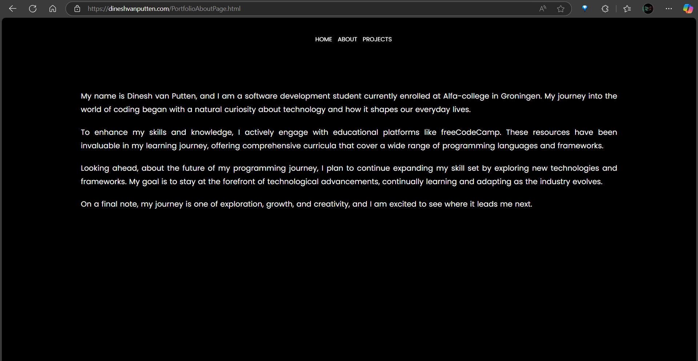

# Dinesh van Putten Portfolio Website

## Overview

This is a personal portfolio website created by **Dinesh van Putten**, a software development student at Alfa College in Groningen, Europapark. The website showcases my skills, projects, and achievements in software development. It serves as a school assignment and demonstrates my proficiency in web development.

The website includes:
- An introduction section.
- A detailed overview of my projects.
- Links to my social media profiles.
- A responsive layout for seamless viewing across devices.

## Table of Contents

- [Dinesh van Putten Portfolio Website](#dinesh-van-putten-portfolio-website)
  - [Overview](#overview)
  - [Table of Contents](#table-of-contents)
  - [Live Demo](#live-demo)
  - [Prerequisites](#prerequisites)
  - [Known Issues](#known-issues)
  - [Contributing](#contributing)
  - [Testing](#testing)
  - [Built With](#built-with)
  - [Project Structure (UML-like Representation)](#project-structure-uml-like-representation)
  - [Visual UML Diagram](#visual-uml-diagram)
  - [Features](#features)
  - [Technologies Used](#technologies-used)
  - [Project Structure](#project-structure)
  - [Installation](#installation)
  - [Walkthrough](#walkthrough)
    - [Home Page](#home-page)
    - [About Page](#about-page)
    - [Projects Page](#projects-page)
    - [Contact Page](#contact-page)
  - [License](#license)
  - [Contact](#contact)
  - [Acknowledgments](#acknowledgments)

## Live Demo

Check out the live version of my portfolio: [Dineshvanputten.com](https://dineshvanputten.com/index.html)

## Prerequisites

- A modern web browser (e.g., Chrome, Firefox, Edge).
- [Visual Studio Code](https://code.visualstudio.com/) or any code editor.

## Known Issues

- The contact form is not functional yet.
- Some images may not load on slower connections.

## Contributing

Contributions are welcome! If you'd like to contribute, please fork the repository and submit a pull request. For major changes, please open an issue first to discuss what you'd like to change.

1. Fork the repository.
2. Create a new branch (`git checkout -b feature-branch`).
3. Commit your changes (`git commit -m "Add new feature"`).
4. Push to the branch (`git push origin feature-branch`).
5. Open a pull request.

## Testing

To test the website:

1. Open the project in a browser.
2. Navigate through all pages (Home, About, Projects, Contact).
3. Test responsiveness by resizing the browser window.
4. Verify that all links and images work correctly.

## Built With

- [HTML5](https://developer.mozilla.org/en-US/docs/Web/HTML) - Markup language for structuring the website.
- [CSS3](https://developer.mozilla.org/en-US/docs/Web/CSS) - Styling and responsive design.
- [JavaScript](https://developer.mozilla.org/en-US/docs/Web/JavaScript) - Interactive features and functionality.
- [Visual Studio Code](https://code.visualstudio.com/) - Code editor used for development.

## Project Structure (UML-like Representation)

## Visual UML Diagram

## Features

- **Introduction Section**: A brief overview of who I am and what I do.
- **Projects Section**: A showcase of key projects, including game development and web design, with image previews and descriptions.
- **Social Media Links**: Easy access to my LinkedIn, GitHub, and freeCodeCamp profiles.
- **Contact Information**: Details on how to reach me directly.

## Technologies Used

- **HTML5**: For structuring the web pages.
- **CSS3**: For styling and responsive design.
- **JavaScript**: For interactive features like smooth page transitions.

## Project Structure

## Installation

1. Download and install [Visual Studio Code](https://code.visualstudio.com/).
2. Clone or download this repository.
3. Open the project folder in Visual Studio Code.
4. Open `index.html` in a browser to view the website.

## Walkthrough

### Home Page
The home page introduces me as a software development student and provides links to other sections of my portfolio, such as About, Projects, CV, and Contact pages.

### About Page
The About page provides a deeper look into my educational background, learning journey, and future goals.

### Projects Page
The Projects page showcases some of my key projects, including:
- **Arcade Game Website**: A collection of games like Tic Tac Toe, Math Game, and Space Invasion.
- **Nilda Pinto SBO Website**: A website built for a school project using HTML and CSS.
  

### Contact Page
The Contact page provides my contact information and links to my social media profiles.

## License

Distributed under the [MIT License](https://choosealicense.com/licenses/mit/). See `LICENSE` for more information.

## Contact

Dinesh van Putten  
📫 Email: **dineshvanputten@outlook.com**  
[LinkedIn](https://www.linkedin.com/in/dinesh-van-putten-69441b18a/) | [GitHub](https://github.com/GODiiKING) | [freeCodeCamp](https://www.freecodecamp.org/GODiKING)

## Acknowledgments

- [Responsive Web Design by freeCodeCamp](https://www.freecodecamp.org/learn/2022/responsive-web-design/)
- [Choose an Open Source License](https://choosealicense.com/)